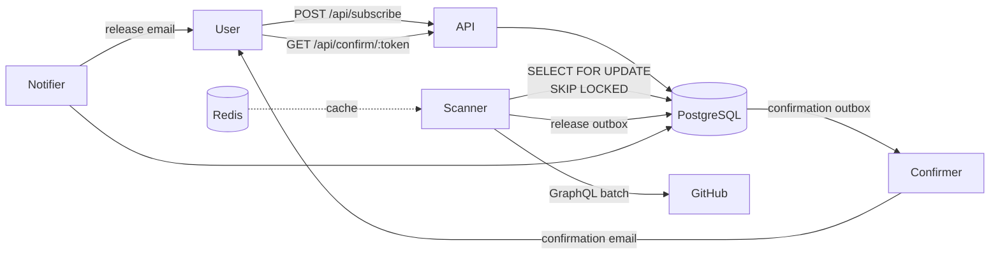

<div align="center">


<p><em>Don't monitor GitHub. Just see the updates.</em></p>

<a href="https://reposeetory.com">🌐 reposeetory.com</a> &nbsp;·&nbsp;
<a href="https://reposeetory.com/swagger/">📖 API Docs</a> &nbsp;·&nbsp;
<a href="https://destream.net/live/ananaslegend/donate">❤️ Support me</a>

<br/>

[](https://github.com/ananaslegend/reposeetory/actions/workflows/ci.yml)


</div>

---

## What it does

Reposeetory lets you subscribe to any public GitHub repository and receive an email notification every time a new release is published.

1. Submit your email + repository on the [landing page](https://reposeetory.com)
2. Confirm via the link sent to your inbox
3. Get notified on every new release — unsubscribe anytime with one click

---

## Architecture

### Flow



The service is a single Go binary that runs four concurrent components: **HTTP API**, **Scanner**, **Notifier**, and **Confirmer** — all backed by the same PostgreSQL instance.

### Key engineering decisions

**1. Outbox pattern for emails**

Sending an email directly inside an HTTP handler risks partial failure — the subscription is saved but the confirmation email is never sent (or vice versa). Instead, `POST /api/subscribe` writes both the subscription row and a confirmation task into `confirmation_notifications` in a **single transaction**. A separate Confirmer cron drains the outbox and sends emails asynchronously. The same pattern is used for release notifications.

**2. Horizontal scaling via `SELECT FOR UPDATE SKIP LOCKED`**

Both Scanner and Notifier use `SELECT ... FOR UPDATE SKIP LOCKED` when claiming work from the database. This means multiple replicas of the service can run concurrently — each replica picks up a different row and no release notification is ever sent twice. No external coordination (Redis locks, leader election) is needed.

**3. Transactor via context**

Repositories don't know whether they're running inside a transaction or not. `transactor.ConnFromContext(ctx, pool)` returns the active `pgx.Tx` if one exists in the context, or falls back to the pool otherwise. Business logic in the service layer calls `WithinTransaction` and composes repository calls freely — the transaction boundary is invisible to individual repos.

**4. Redis caching decorator for GitHub API**

Without a token, GitHub's API allows only 60 requests/hour. The `CachingReleaseProvider` wraps the real GitHub client as a decorator: on each Scanner tick it issues a single `MGET` for all repositories, fills misses via a pipeline `SET` with 10-minute TTL, and falls back silently to the underlying client on any Redis error. The Scanner never sees the cache layer.

**5. Interfaces at the consumer**

Every interface (`service.Repository`, `notifier.MailSender`, `scanner.ReleaseProvider`, …) is defined in the package that uses it, not in the package that implements it. This keeps dependencies pointing inward, makes each module independently testable with generated mocks (`uber-go/mock`), and allows swapping implementations (e.g. `StubMailer` ↔ `SMTPMailer`) without touching business logic.

---

## Extras

| Feature | Status |
|---|---|
| Deployed (reposeetory.com) | ✅ |
| Redis cache for GitHub API (TTL 10 min) | ✅ |
| Prometheus metrics (`/metrics`) | ✅ |
| GitHub Actions CI (lint + test + build) | ✅ |
| Swagger UI (`/swagger/`) | ✅ |
| Web UI (landing + full subscription flow) | ✅ |

---

## Getting started

### Prerequisites

- Docker & Docker Compose
- GitHub personal access token (required for the scanner)

### Run locally

```bash
cp .env.example .env
# Add GITHUB_TOKEN to .env
make docker-up
```

| URL | Description |
|---|---|
| `http://localhost:8080` | API + landing page |
| `http://localhost:8080/swagger/` | Swagger UI |
| `http://localhost:8025` | Mailpit — catch all outgoing emails |
| `http://localhost:9090` | Prometheus metrics (via `/metrics`) |

### Key configuration

| Variable | Default | Description |
|---|---|---|
| `DATABASE_URL` | required | PostgreSQL connection string |
| `GITHUB_TOKEN` | required | GitHub PAT — scanner won't start without it |
| `APP_BASE_URL` | `http://localhost:8080` | Base URL used in confirmation/unsubscribe links |
| `SMTP_HOST` | — | If empty, stub mailer logs emails to stdout |
| `REDIS_URL` | — | If empty, GitHub API cache is disabled |
| `SCANNER_INTERVAL` | `5m` | How often to check for new releases |
| `NOTIFIER_INTERVAL` | `30s` | How often to drain the release outbox |

Full list of variables is in `.env.example`.

---

## Roadmap

Reposeetory is currently free and open to everyone — no account required.

### Now
- ❤️ [Support the project](https://destream.net/live/ananaslegend/donate)

### Coming soon

- **Authentication** — register and manage all your subscriptions in one place
- **Tiers**
  - _Unregistered_ — 1 subscription per email
  - _Free_ — up to 3 subscriptions per account
  - _Pro_ — up to 100 subscriptions, priority notifications
- **gRPC interface** — alternative to REST API
- **Redis token store** — optimise confirm token lookups with Redis as a fast path, backed by PostgreSQL
