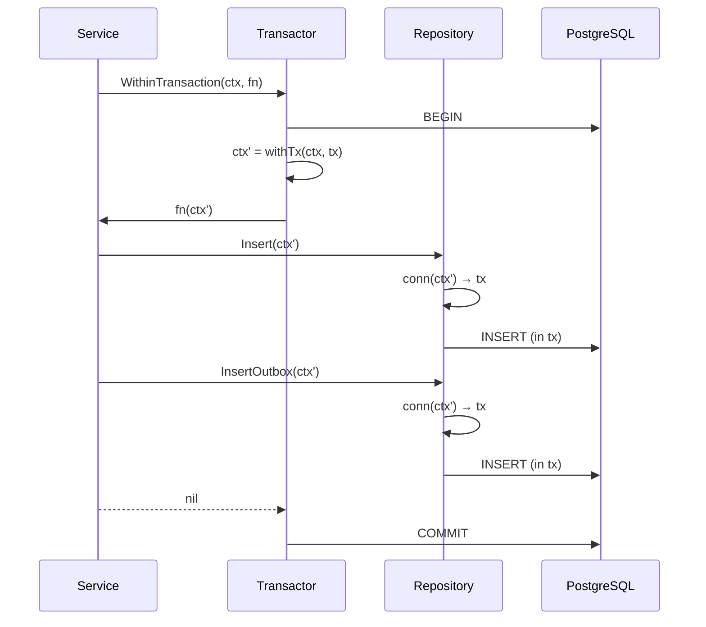

# ADR-0004: Transactions via context (`Transactor`)

Status: accepted · 2026-05-09 · @ananaslegend · persistence

## Context

A single business operation often spans multiple repositories — e.g.
`Service.Subscribe` must insert a `subscriptions` row and a
`confirmation_notifications` row atomically (see ADR-0002). The naive
solution is to thread `pgx.Tx` through every repository signature, but
that pollutes the API and forces every method to exist in two flavours
(with-tx and without-tx). Repositories should be agnostic to whether
they run inside a transaction; only the service layer should decide
when one is needed.

## Decision

A single `internal/transactor/` package owns transaction control:

- `Transactor.WithinTransaction(ctx, fn)` opens a tx, stashes it in
  `ctx` under a private key, runs `fn(ctx')`, then commits or rolls back.
- `Conn` interface unifies `*pgxpool.Pool` and `pgx.Tx` (Exec, Query,
  QueryRow, Begin, CopyFrom, SendBatch).
- `ConnFromContext(ctx, pool) Conn` returns the tx from `ctx` if
  present, otherwise the pool.

Each repository keeps a one-liner:

```go
func (r *Repository) conn(ctx context.Context) transactor.Conn {
    return transactor.ConnFromContext(ctx, r.pool)
}
```

and uses `r.conn(ctx).Exec(...)` everywhere — never `r.pool` directly.



## Consequences

### Positive
- Repository methods are written once; same code path with or without a
  surrounding transaction.
- Service is the only layer that decides on transaction boundaries —
  matches where business invariants live.
- Single wiring point: `txr := transactor.New(pool)` in
  `internal/app/`, passed into every feature `Config`.

### Negative
- Uses `context.Value`, which Go discourages for non-request data.
  Acceptable here because the lifetime is exactly the request and the
  key is unexported (`dbKey{}`).

### Constraints
- Transactions become **implicit** — a reader must trust that callers
  passed the right `ctx`. Mitigated by `wrapcheck` rule ignoring
  `WithinTransaction` to avoid double-wrap, and by the convention that
  *every* repository takes `ctx` as its first arg.

## Links

- `internal/transactor/transactor.go` — `Transactor`, `Conn`,
  `ConnFromContext`.
- `internal/subscription/repository/`, `internal/scanner/repository/`,
  `internal/notifier/repository/`, `internal/confirmer/repository/` —
  callers using the `conn(ctx)` helper.
- ADR-0002 — the canonical use case (atomic write + outbox row).
