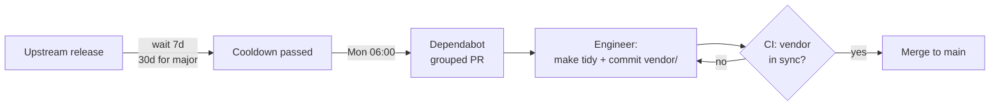

# ADR-0007: Vendor dependencies and batch weekly updates with cooldown

Status: superseded by [ADR-0014](0014-drop-vendoring.md) · 2026-05-09 · @ananaslegend · infra

> **Superseded on 2026-05-16.** Vendoring was dropped because the corporate
> SSL-proxy concern never materialised for this project, while the cost
> (3 250+ tracked files, dedicated CI step, dependabot ritual workflow,
> two-step `make tidy`) was felt every week. The supply-chain cooldown
> argument is preserved by `.github/dependabot.yml`, not by `vendor/`.
> See ADR-0014 for the current decision.

## Context

Letting engineers run `go get` ad hoc and fetching modules from the
proxy at build time brings three problems:

1. **Build-time** — builds may run behind a corporate SSL
   proxy that intercepts TLS. Builds need network access for
   modules to be flaky and not reproducible offline.
2. **Supply chain** — malicious package releases happen periodically
   and are usually yanked within 24–48 hours. An engineer running
   `go get -u` mid-task can pull a poisoned version into a feature PR
   and ship it before the yank lands.
3. **PR noise** — ungrouped per-package weekly updates would drown
   the review queue in mechanical bumps.

## Decision

1. **Vendor everything.** `go mod vendor` is committed; Docker build
   uses `-mod=vendor`. No network during build — CA certs are copied
   from the builder stage. Anything added to `go.mod` must also land
   in `vendor/` in the same commit (`make tidy` does both).
2. **No ad-hoc `go get` during feature work.** Engineers do not pull
   new versions while working on unrelated features. Only `make tidy`
   (for a deliberate new dep) or a merged Dependabot PR introduces new
   module versions. This guarantees the deps we ship are *time-tested*
   — at least one cooldown window old, never `latest` from the moment
   of writing.
3. **Dependabot is the routine source of updates** —
   `.github/dependabot.yml`:
   - Weekly cadence (Mon 06:00 Kyiv).
   - All minor/patch updates grouped into one PR per ecosystem
     (`go-minor-patch`); majors land in their own PRs.
   - **Cooldown**: 7 days for all releases, 30 days for semver-major.

## Consequences

### Positive
- Reproducible Docker builds with no network access — survives the
  corporate proxy and offline environments.
- Dependency code is at least 7 days old when it lands; the typical
  malicious-release yank window has already passed.
- One grouped PR per ecosystem each week instead of dozens of
  per-package bumps; reviewers see all changes in one place.

### Negative
- `vendor/` adds tens of MB to the repo; accepted as the cost of
  reproducible offline builds.
- Security patches land ~7 days slower. For a genuinely critical CVE
  the cooldown can be bypassed by a manual PR.

### Constraints
- Dependabot does **not** regenerate `vendor/`. Each Dependabot PR
  must be checked out locally, `make tidy` run, and `vendor/`
  re-committed. CI step `Verify vendor is in sync` fails the PR until
  this is done.

## Links

- `.github/dependabot.yml` — schedule, grouping, cooldown rules.
- `Dockerfile` — `-mod=vendor` build flag, no `apk add` in runtime
  stage, CA certs copied from builder.
- `Makefile` — `tidy` target (`go mod tidy && go mod vendor`).
- CI workflow — `Verify vendor is in sync` step.
