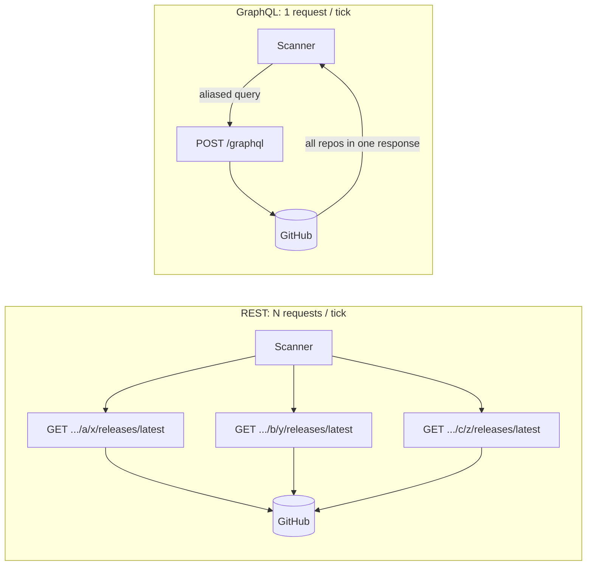

# ADR-0008: Use GitHub GraphQL for batch release fetching

Status: accepted · 2026-05-09 · @ananaslegend · integrations

## Context

The scanner ticks every `SCANNER_INTERVAL` and needs the latest
release tag of every repository with active subscriptions. With N
repositories, the naïve REST approach is one
`GET /repos/{owner}/{repo}/releases/latest` per repo — N HTTP requests
per tick. Latency, rate-limit cost, and connection churn all grow
linearly with N. Concurrent fan-out reduces latency but burns the
same rate-limit budget and produces spiky traffic against GitHub.

GitHub also exposes a GraphQL API that lets a single query fetch the
latest release for an arbitrary list of repositories via field aliases.

## Decision

The GitHub client (`internal/github/client.go`) issues **one GraphQL
query per tick** with one aliased subquery per repository:

```graphql
query {
  r0: repository(owner:"a", name:"x") { latestRelease { tagName } }
  r1: repository(owner:"b", name:"y") { latestRelease { tagName } }
  ...
}
```

The response is decoded into a map and returned to the scanner in one
go. `GITHUB_TOKEN` is required — GraphQL rejects unauthenticated
requests with 403, so the scanner refuses to start without it.



On top of this client we wrap a Redis caching decorator
(`CachingReleaseProvider` in `internal/github/caching_client.go`) that
collapses repeated GraphQL calls within a 10-minute window — `MGET`
for reads, a pipeline `SET` for writes. If Redis is unreachable the
decorator falls back silently to the wrapped GraphQL client; the
cache is an optimisation, not a hard dependency. Wiring lives in
`internal/app/`: the bare GraphQL client is decorated with caching
only when `REDIS_URL` is configured.

## Consequences

### Positive
- O(1) HTTP requests per tick instead of O(N). Latency stays flat as
  subscriptions grow.
- One rate-limit charge per tick — predictable cost, easy to fit
  inside the 5000-point/h authenticated budget.
- No traffic spikes; GitHub sees one steady request per
  `SCANNER_INTERVAL`.

### Negative
- Query construction and response parsing are heavier than REST URL
  building. Mitigated by isolating GraphQL details in
  `internal/github/`; the rest of the codebase sees a flat
  `ReleaseProvider` interface returning a `map[repoID]tag`.

### Constraints
- `GITHUB_TOKEN` is mandatory. REST allows some unauthenticated calls;
  GraphQL does not. The scanner logs a warning and skips startup if
  the token is missing.
- Mocking in tests needs an `httptest.Server` returning shaped
  GraphQL JSON, not URL-match stubs. Done once in `client_test.go`;
  scanner-level tests use `StubClient` instead.

## Links

- `internal/github/client.go` — GraphQL client.
- `internal/github/client_test.go` — HTTP-level tests via
  `httptest.Server`.
- `internal/github/stub.go` — `StubClient` for non-HTTP tests.
- `internal/github/caching_client.go` — Redis decorator that further
  collapses GraphQL calls within a 10-minute window.
