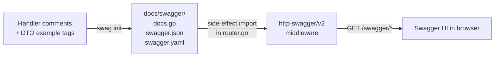

# ADR-0009: Generate API documentation from code annotations with `swaggo/swag`

Status: accepted · 2026-05-09 · @ananaslegend · http

## Context

The HTTP API needs machine-readable documentation: a discovery point
for clients, a contract for review, and a way to keep "what the API
does" close to the code that does it. Three approaches were on the
table:

1. **Spec-first** — write OpenAPI YAML by hand, generate handlers
   with `ogen` or `oapi-codegen`. The schema is the source of truth.
2. **Code-first with annotations** — write handlers in Go, annotate
   them with structured comments, generate the schema with a tool
   like `swaggo/swag`.
3. **No machine-readable docs** — README and inline comments only.

A code-first project of this size, with a per-feature layout
([ADR-0001](0001-screaming-architecture.md)) and DTOs already
expressed as Go types, fits annotations more naturally than a parallel
YAML contract that would drift from the code.

## Decision

Use `swaggo/swag` to generate OpenAPI 2.0 docs from comments on
handlers and `example:` tags on DTOs.

- `//go:generate swag init -g cmd/api/main.go -o docs/swagger
  --parseDependency` in `cmd/api/main.go`. Triggered via `make swagger`
  or `go generate`.
- Global metadata (`@title`, `@host`, `@BasePath`) at the top of
  `cmd/api/main.go`.
- Per-handler annotations (`@Summary`, `@Tags`, `@Param`, `@Success`,
  `@Failure`, `@Router`) directly above each handler in
  `internal/<feature>/http/handler.go`.
- DTOs in `internal/<feature>/http/dto.go` carry `example:` tags for
  realistic sample values.
- `docs/swagger/` (Go package + JSON + YAML) is **committed** — same
  reasoning as vendoring
  ([ADR-0007](0007-vendor-and-dependency-updates.md)): reproducible
  builds without network or extra tooling at build time.
- `internal/httpapi/router.go` imports `docs/swagger` for its
  side-effect (registering the spec) and exposes `GET /swagger/*` via
  `http-swagger/v2`.

## Consequences

### Positive
- API docs live next to the code they describe; less drift than a
  parallel YAML contract.
- A handler signature change cannot silently break docs — `swag init`
  fails if annotations and types disagree.

### Negative
- Locked to OpenAPI 2.0 — `swaggo/swag` mainline does not target 3.x.
  Acceptable for now; migrating later means swapping the generator,
  not rewriting handlers.
- Annotation syntax is vendor-specific and not validated by the Go
  compiler or IDE; typos surface only at `swag init` time. Mitigated
  by running generation in CI.

### Constraints
- `docs/swagger/` is a generated artefact in git. Diff noise on every
  endpoint change is the cost of reproducible builds. CI must verify
  the directory is in sync, mirroring the vendor-sync check.
- `swag` CLI is a manual prerequisite (`go install`), not vendored.
  Version is pinned via `SWAG_VERSION` in `Makefile`; `make
  swagger-install` installs it locally, CI installs the same version
  inline before the in-sync check.

## Links

- `cmd/api/main.go` — `//go:generate` directive and global metadata.
- `internal/subscription/http/handler.go` — example of per-handler
  annotations.
- `internal/httpapi/router.go` — side-effect import and Swagger UI
  registration.
- `docs/swagger/` — generated artefacts (do not edit by hand).
