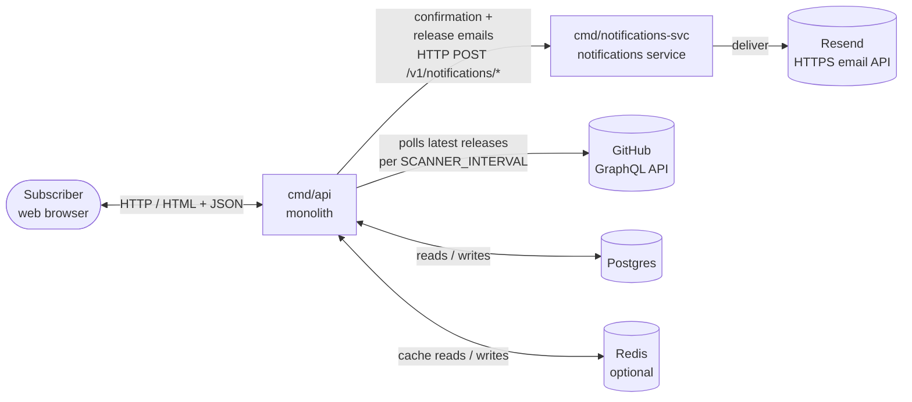
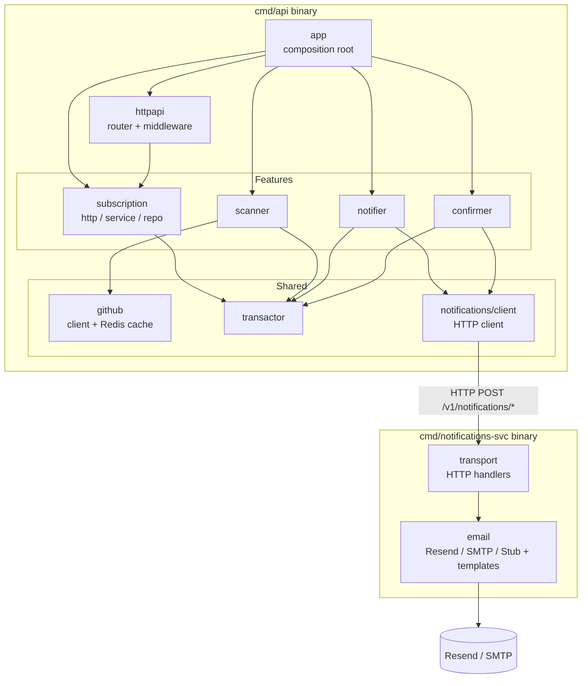
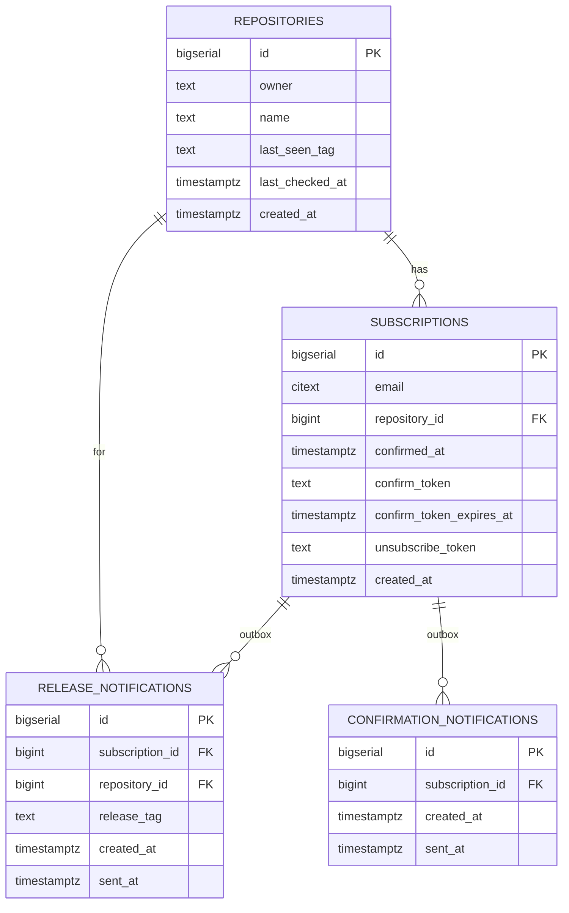
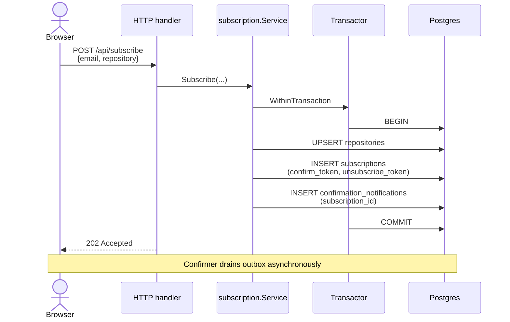
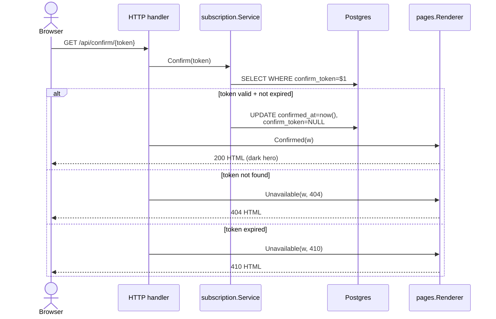
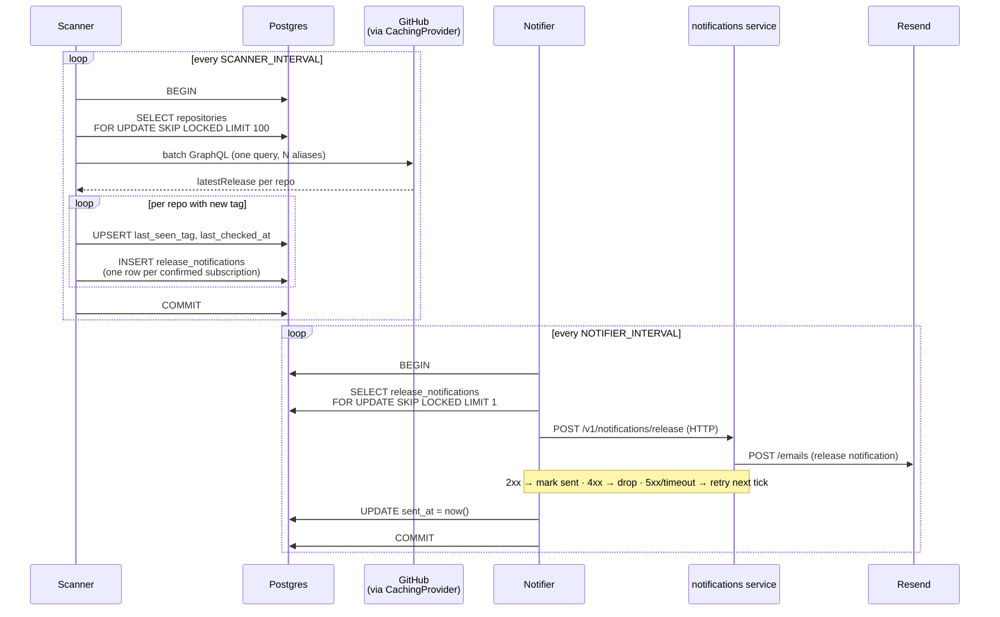
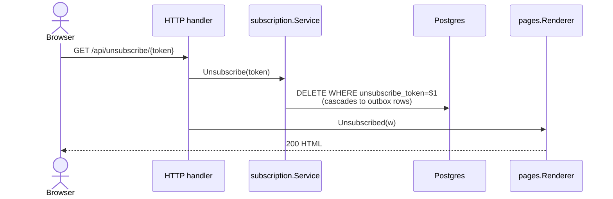

# Architecture Overview

A high-level reference for the `reposeetory` service. Describes the
*current* shape of the system: components, data, processes, external
dependencies. For *why* each piece looks this way, follow the links
to the relevant [ADR](./adr/README.md).

---

## 1. System context

A subscriber lands on the HTML page, submits an email + repo, gets a
confirmation email, and from then on receives a notification each
time a new release tag appears on that repo.

---

## 2. Components

Two binaries: the monolith `cmd/api` and the standalone
`cmd/notifications-svc` notifications service (email is the current
delivery channel). Internal packages are organised as feature folders
(see [ADR-0001](./adr/0001-screaming-architecture.md)).

| Component           | Responsibility                                                             | Key ADRs |
|---------------------|----------------------------------------------------------------------------|----------|
| `subscription/`     | HTTP API, business rules, persistence for subscriptions and repositories. | 0001, 0002, 0010 |
| `scanner/`          | Periodic GitHub poll, batch detection of new release tags.                | 0008 |
| `notifier/`         | Drains `release_notifications` outbox; sends via `notifications/client` over HTTP. | 0003 |
| `confirmer/`        | Drains `confirmation_notifications` outbox; sends via `notifications/client` over HTTP. | 0003 |
| `github/`           | GraphQL client + Redis caching decorator (`CachingReleaseProvider`).       | 0008 |
| `transactor/`       | Transaction boundaries via `context.Context`.                              | 0004 |
| `notifications/client/` | Monolith-side HTTP client to the notifications service; satisfies the drainers' `NotificationsSender`. | — |
| `cmd/notifications-svc`        | Standalone, stateless notifications service: Resend/SMTP + templates, `POST /v1/notifications/*`. | 0013 |
| `httpapi/`          | Cross-cutting HTTP: chi router, middleware, error mapping, metrics.        | 0005, 0006 |
| `app/`              | Composition root: wires everything based on env config.                   | 0001 |

---

## 3. Data model

### Key invariants

- **Subscription state is encoded in a CHECK constraint:**
  `confirmed_at IS NULL ↔ confirm_token IS NOT NULL`. Pending and
  confirmed are mutually exclusive states; no orphan tokens.
- **Outbox FIFO:** partial index on `(created_at) WHERE sent_at IS NULL`
  keeps drain queries cheap regardless of historical row count.
- **Cascade on delete:** unsubscribe is a hard delete on
  `subscriptions`; outbox rows cascade away. GDPR-clean.
- **Unique `(email, repository_id)`:** one subscription per pair; a
  re-subscribe regenerates the confirm token rather than duplicating.

See [ADR-0003](./adr/0003-async-email-outbox.md) for outbox-pattern
rationale.

---

## 4. Processes

### 4.1 Subscribe

### 4.2 Confirm subscription

### 4.3 Scan & notify

Two independent loops; the outbox is the only contract between them.

### 4.4 Unsubscribe

---

## 5. External dependencies

| Dependency        | Required | Purpose                                          | Fallback if absent |
|-------------------|----------|--------------------------------------------------|--------------------|
| Postgres          | yes      | Source of truth for subscriptions + outboxes (monolith). | monolith refuses to start |
| GitHub GraphQL    | yes      | Latest release per repo, batched.                | scanner skips startup with WARN |
| Notifications service (HTTP) | yes  | Email rendering + delivery for the monolith.     | drainers retry via outbox until it is reachable |
| Resend (HTTPS)    | no       | Outbound transactional email (used by the notifications service). | `StubMailer` (logs to stdout) |
| Redis             | no       | 10-min cache of GitHub releases.                 | `CachingReleaseProvider` is not wired in |

The notifications service is the clearest example of the swap-friendly design:
adding or replacing a provider is a new file under
`internal/notifications/email/` plus one `case` in `cmd/notifications-svc/main.go` —
`notifier/`, `confirmer/`, and the business logic stay untouched.

External integrations are hidden behind small interfaces inside
`internal/github/` and `internal/notifications/email/`. See
[ADR-0008](./adr/0008-github-graphql-batch-fetch.md) for GraphQL
rationale, [ADR-0002](./adr/0002-consumer-side-interfaces.md) for the
interface-placement convention.

---

## 6. Configuration

All configuration is environment-based (`envconfig` + optional `.env`).
The full surface — every variable, default, and meaning — lives in
[CLAUDE.md › Configuration](../CLAUDE.md#configuration-env-vars). This
document does not duplicate it.

Key knobs that shape runtime behaviour:

- `SCANNER_INTERVAL`, `NOTIFIER_INTERVAL`, `CONFIRMER_INTERVAL` —
  loop cadence.
- `GITHUB_TOKEN` — gate for the scanner.
- `REDIS_URL` — gate for the GitHub caching decorator.
- `RESEND_API_KEY` — selects Resend (production default); without it,
  `StubMailer` logs to stdout.

---

## 7. Cross-references

| Concern                          | ADR |
|----------------------------------|-----|
| Per-feature folder layout        | [0001](./adr/0001-screaming-architecture.md) |
| Interfaces in consumer packages  | [0002](./adr/0002-consumer-side-interfaces.md) |
| Outbox pattern for email         | [0003](./adr/0003-async-email-outbox.md) |
| Transactions via context         | [0004](./adr/0004-transactor-via-context.md) |
| Error wrapping convention        | [0005](./adr/0005-error-wrapping-convention.md) |
| Logger via context               | [0006](./adr/0006-logger-via-context.md) |
| Vendoring + dep cooldown         | [0007](./adr/0007-vendor-and-dependency-updates.md) |
| GitHub GraphQL batch fetching    | [0008](./adr/0008-github-graphql-batch-fetch.md) |
| Swagger from annotations         | [0009](./adr/0009-swagger-from-annotations.md) |
| Server-rendered HTML, no JS      | [0010](./adr/0010-server-rendered-html-no-js.md) |
| Testing strategy                 | [0011](./adr/0011-testing-strategy.md) |
