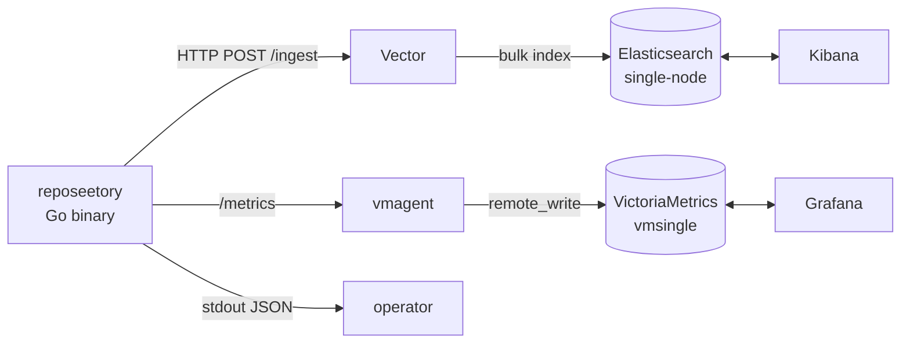

# Observability Stack Implementation Plan

> **For agentic workers:** REQUIRED SUB-SKILL: Use superpowers:subagent-driven-development (recommended) or superpowers:executing-plans to implement this plan task-by-task. Steps use checkbox (`- [ ]`) syntax for tracking.

**Goal:** Add a structured-log pipeline (zerolog → Vector → Elasticsearch → Kibana) and a RED-metrics pipeline (Prometheus instrumentation → vmagent → VictoriaMetrics → Grafana) to the `reposeetory` service, working both locally (docker-compose overlay) and on Railway.

**Architecture:** Six sequential phases. Phases 1–2 are pure Go code, backwards-compatible no-ops if observability env vars are empty. Phase 3 adds the docker-compose overlay. Phase 4 wires Grafana provisioning + ES ILM bootstrap. Phase 5 documents Railway-deploy readiness. Phase 6 finalizes ADRs and project docs.

**Tech Stack:** Go (zerolog, prometheus/client_golang), Vector 0.x, Elasticsearch 8.x, Kibana 8.x, VictoriaMetrics (vmsingle + vmagent), Grafana 10.x, Docker Compose.

**Spec:** `docs/superpowers/specs/2026-06-03-observability-design.md`

---

## File Structure

**Phase 1 — RED metrics + outbox depth (Go code):**

| File | Action | Responsibility |
|---|---|---|
| `internal/observability/redmetrics/redmetrics.go` | Create | Generic RED metric pair factory (counter + histogram) |
| `internal/observability/redmetrics/redmetrics_test.go` | Create | Unit tests for redmetrics |
| `internal/observability/outboxcollector/collector.go` | Create | `prometheus.Collector` for outbox depth gauges |
| `internal/observability/outboxcollector/collector_test.go` | Create | Unit test using testcontainers Postgres |
| `internal/observability/emailermetrics/wrapper.go` | Create | RED-decorator around `emailer.Emailer` |
| `internal/observability/emailermetrics/wrapper_test.go` | Create | Unit tests for decorator |
| `internal/app/observability.go` | Create | Construct all RED-metric structs in one place |
| `internal/app/metrics.go` | Modify | Register outboxcollector alongside `NewPoolCollector` |
| `internal/app/mailer.go` | Modify | Wrap returned emailer with `emailermetrics.Wrap` |
| `internal/app/workers.go` | Modify | Pass per-component RED structs into Scanner/Notifier/Confirmer |
| `internal/app/app.go` | Modify | Call `newObservability(reg)` and pass to workers/github |
| `internal/scanner/scanner.go` | Modify | Replace `s.m.ticksTotal` calls with redmetrics; add duration |
| `internal/scanner/metrics.go` | Modify | Remove `ticksTotal` (moved to redmetrics); keep business counters |
| `internal/scanner/scanner_test.go` | Modify | Update assertions for new metric names |
| `internal/notifier/notifier.go` | Modify | Add tick counter + duration via redmetrics |
| `internal/notifier/notifier_test.go` | Modify | Assertions for new metrics |
| `internal/confirmer/confirmer.go` | Modify | Add tick counter + duration via redmetrics |
| `internal/confirmer/confirmer_test.go` | Modify | Assertions for new metrics |
| `internal/github/caching_client.go` | Modify | RED for `GetLatestReleases` (result=ok|cached|error) |
| `internal/github/caching_client_test.go` | Modify | Assertions for new RED metrics |

**Phase 2 — logshipper (Go code):**

| File | Action | Responsibility |
|---|---|---|
| `internal/observability/logshipper/logshipper.go` | Create | `io.Writer` that ships zerolog JSON to Vector HTTP source |
| `internal/observability/logshipper/logshipper_test.go` | Create | Unit tests (fake HTTP server) |
| `internal/config/config.go` | Modify | Add `VectorIngestURL`, `LogServiceName`, `LogEnv`, `LogVersion`, `LogShipper*` fields |
| `internal/app/logger.go` | Modify | Accept optional `*logshipper.Writer`, MultiLevelWriter, enrich with service/env/version |
| `internal/app/app.go` | Modify | Create shipper in `Run`, pass into `New` |
| `.env.example` | Modify | Document new env vars |

**Phase 3 — docker-compose overlay + Makefile:**

| File | Action |
|---|---|
| `docker-compose.observability.yml` | Create |
| `infra/vector/vector.toml` | Create |
| `infra/vmagent/vmagent.yml` | Create |
| `infra/grafana/provisioning/datasources/victoria-metrics.yml` | Create (stub; populated in Phase 4) |
| `Makefile` | Modify (add `obs-up`, `obs-down`, `obs-init`) |
| `docker-compose.yml` | Modify (add `VECTOR_INGEST_URL` to api env) |
| `.env.example` | Modify (already done in Phase 2; verify obs vars present) |

**Phase 4 — Grafana provisioning + ES ILM bootstrap:**

| File | Action |
|---|---|
| `infra/grafana/provisioning/dashboards/dashboards.yml` | Create |
| `infra/grafana/provisioning/dashboards/reposeetory-red.json` | Create |
| `infra/grafana/provisioning/datasources/victoria-metrics.yml` | Modify (final form) |
| `scripts/obs-init.sh` | Create |

**Phase 5 — Railway readiness:**

| File | Action |
|---|---|
| `docs/operations/observability.md` | Create |
| `docs/operations/README.md` | Create (index) |

**Phase 6 — ADRs + project docs:**

| File | Action |
|---|---|
| `docs/adr/0017-observability-stack.md` | Create |
| `docs/adr/0018-red-metrics-conventions.md` | Create |
| `docs/adr/README.md` | Modify (add new ADRs to index) |
| `docs/architecture.md` | Modify (add observability section) |
| `CLAUDE.md` | Modify (link new ADRs, update Commands) |

---

# Phase 1 — RED metrics + outbox depth collector

Goal: every component boundary in the app exposes RED triplets through a unified helper, plus outbox-depth gauges. No infrastructure changes; `/metrics` simply gains new series. Backwards-compatible.

## Task 1.1: Create `redmetrics` package skeleton + failing test

**Files:**
- Create: `internal/observability/redmetrics/redmetrics.go`
- Create: `internal/observability/redmetrics/redmetrics_test.go`

- [ ] **Step 1: Write failing test for the constructor**

Create `internal/observability/redmetrics/redmetrics_test.go`:

```go
package redmetrics_test

import (
	"testing"
	"time"

	"github.com/prometheus/client_golang/prometheus"
	"github.com/prometheus/client_golang/prometheus/testutil"

	"github.com/ananaslegend/reposeetory/internal/observability/redmetrics"
)

func TestNew_RegistersMetricsWithCorrectNames(t *testing.T) {
	reg := prometheus.NewRegistry()
	red := redmetrics.New(redmetrics.Config{
		Subsystem: "demo",
		Registry:  reg,
	})

	red.Observe("ok", 10*time.Millisecond)

	const expected = `
# HELP demo_requests_total Total number of demo operations.
# TYPE demo_requests_total counter
demo_requests_total{result="ok"} 1
`
	if err := testutil.GatherAndCompare(reg, stringsReader(expected), "demo_requests_total"); err != nil {
		t.Fatal(err)
	}
}

func stringsReader(s string) interface {
	Read(p []byte) (n int, err error)
} {
	return &readerFromString{s: s}
}

type readerFromString struct {
	s string
	i int
}

func (r *readerFromString) Read(p []byte) (int, error) {
	if r.i >= len(r.s) {
		return 0, errEOF
	}
	n := copy(p, r.s[r.i:])
	r.i += n
	return n, nil
}

var errEOF = readerEOF{}

type readerEOF struct{}

func (readerEOF) Error() string { return "EOF" }
```

- [ ] **Step 2: Run test to verify it fails (package missing)**

```
go test ./internal/observability/redmetrics/...
```

Expected: build failure — `package redmetrics not found`.

- [ ] **Step 3: Implement minimal `redmetrics.go`**

Create `internal/observability/redmetrics/redmetrics.go`:

```go
// Package redmetrics provides a small helper for the RED methodology
// (rate / errors / duration) — a uniform counter + histogram pair per subsystem.
//
// Usage:
//   m := redmetrics.New(redmetrics.Config{Subsystem: "github_client", Registry: reg})
//   start := time.Now()
//   ...
//   m.Observe("ok", time.Since(start))
package redmetrics

import (
	"time"

	"github.com/prometheus/client_golang/prometheus"
)

// Config controls how a RED metric pair is built.
type Config struct {
	// Subsystem becomes the metric prefix (e.g. "github_client" → "github_client_requests_total").
	Subsystem string
	// ExtraLabels are appended after the mandatory "result" label.
	// Example: []string{"driver"} for the email subsystem.
	ExtraLabels []string
	// Buckets overrides histogram buckets (nil → DefaultBuckets).
	Buckets []float64
	// Registry receives the metrics. nil is allowed (useful in tests).
	Registry *prometheus.Registry
}

// RED is a counter + histogram pair following the RED methodology.
type RED struct {
	requests    *prometheus.CounterVec
	duration    *prometheus.HistogramVec
	extraLabels []string
}

// DefaultBuckets cover sub-second latencies typical of HTTP / outbound calls.
var DefaultBuckets = []float64{0.005, 0.01, 0.025, 0.05, 0.1, 0.25, 0.5, 1, 2.5, 5, 10, 30}

// New constructs a RED pair and registers it on cfg.Registry (if non-nil).
func New(cfg Config) *RED {
	buckets := cfg.Buckets
	if buckets == nil {
		buckets = DefaultBuckets
	}
	labels := append([]string{"result"}, cfg.ExtraLabels...)
	r := &RED{
		requests: prometheus.NewCounterVec(prometheus.CounterOpts{
			Name: cfg.Subsystem + "_requests_total",
			Help: "Total number of " + cfg.Subsystem + " operations.",
		}, labels),
		duration: prometheus.NewHistogramVec(prometheus.HistogramOpts{
			Name:    cfg.Subsystem + "_request_duration_seconds",
			Help:    "Duration of " + cfg.Subsystem + " operations in seconds.",
			Buckets: buckets,
		}, labels),
		extraLabels: cfg.ExtraLabels,
	}
	if cfg.Registry != nil {
		cfg.Registry.MustRegister(r.requests, r.duration)
	}
	return r
}

// Observe records one operation. extraLabels must be passed in the same order
// as Config.ExtraLabels; if no extra labels were declared, pass nothing.
func (m *RED) Observe(result string, dur time.Duration, extraLabels ...string) {
	if m == nil {
		return
	}
	values := append([]string{result}, extraLabels...)
	m.requests.WithLabelValues(values...).Inc()
	m.duration.WithLabelValues(values...).Observe(dur.Seconds())
}
```

- [ ] **Step 4: Re-run the test, simplify with `strings.NewReader`**

Replace the ad-hoc reader in the test with `strings.NewReader` (cleaner). Update test imports to add `"strings"`. Replace `stringsReader(expected)` with `strings.NewReader(expected)` and delete the helper types.

Final test body:

```go
package redmetrics_test

import (
	"strings"
	"testing"
	"time"

	"github.com/prometheus/client_golang/prometheus"
	"github.com/prometheus/client_golang/prometheus/testutil"

	"github.com/ananaslegend/reposeetory/internal/observability/redmetrics"
)

func TestNew_RegistersMetricsWithCorrectNames(t *testing.T) {
	reg := prometheus.NewRegistry()
	red := redmetrics.New(redmetrics.Config{Subsystem: "demo", Registry: reg})

	red.Observe("ok", 10*time.Millisecond)

	const expected = `
# HELP demo_requests_total Total number of demo operations.
# TYPE demo_requests_total counter
demo_requests_total{result="ok"} 1
`
	if err := testutil.GatherAndCompare(reg, strings.NewReader(expected), "demo_requests_total"); err != nil {
		t.Fatal(err)
	}
}
```

Run:

```
go test ./internal/observability/redmetrics/...
```

Expected: PASS.

- [ ] **Step 5: Add nil-Registry test**

Append to the test file:

```go
func TestNew_NilRegistryDoesNotPanic(t *testing.T) {
	red := redmetrics.New(redmetrics.Config{Subsystem: "demo"})
	red.Observe("ok", 5*time.Millisecond) // must not panic
}

func TestNew_WithExtraLabels(t *testing.T) {
	reg := prometheus.NewRegistry()
	red := redmetrics.New(redmetrics.Config{
		Subsystem:   "email",
		ExtraLabels: []string{"driver"},
		Registry:    reg,
	})

	red.Observe("ok", 5*time.Millisecond, "resend")
	red.Observe("error", 5*time.Millisecond, "smtp")

	const expected = `
# HELP email_requests_total Total number of email operations.
# TYPE email_requests_total counter
email_requests_total{driver="resend",result="ok"} 1
email_requests_total{driver="smtp",result="error"} 1
`
	if err := testutil.GatherAndCompare(reg, strings.NewReader(expected), "email_requests_total"); err != nil {
		t.Fatal(err)
	}
}
```

Run:

```
go test ./internal/observability/redmetrics/...
```

Expected: PASS.

- [ ] **Step 6: Commit**

```
git add internal/observability/redmetrics/
git commit -m "feat(observability): add redmetrics helper for RED metric pairs"
```

---

## Task 1.2: Refactor `scanner` to use redmetrics

The scanner already has `scanner_ticks_total{result}` with three values (`ok`, `error`, `rate_limited`). We replace this counter with a redmetrics-managed pair (gains duration histogram for free), and preserve `scanner_repos_scanned_total` and `scanner_github_rate_limited_total` as business counters.

**Files:**
- Modify: `internal/scanner/metrics.go`
- Modify: `internal/scanner/scanner.go`
- Modify: `internal/scanner/scanner_test.go`

- [ ] **Step 1: Modify `scanner_test.go` — add failing assertion for tick duration**

Open `internal/scanner/scanner_test.go`. Locate any existing test that calls `Tick` and runs assertions on `scanner_ticks_total`. Add (or replace the assertion block with) a check for the new metric name shape. Add an import for `strings` if not already present.

Add this new test at the end of the file:

```go
func TestScanner_TickRecordsRED(t *testing.T) {
	// Setup with whatever existing helper (mocks + scanner.Config{Registry: reg, RED: ...})
	reg := prometheus.NewRegistry()
	// ... build minimal Scanner that returns success ...
	// (Copy the wiring from an existing passing test; only the assertions below are new.)

	err := s.Tick(context.Background())
	if err != nil {
		t.Fatalf("Tick: %v", err)
	}

	families, err := reg.Gather()
	if err != nil {
		t.Fatalf("Gather: %v", err)
	}
	if !hasMetric(families, "scanner_requests_total") {
		t.Fatalf("expected scanner_requests_total in registry")
	}
	if !hasMetric(families, "scanner_request_duration_seconds") {
		t.Fatalf("expected scanner_request_duration_seconds in registry")
	}
}

func hasMetric(families []*dto.MetricFamily, name string) bool {
	for _, f := range families {
		if f.GetName() == name {
			return true
		}
	}
	return false
}
```

Add imports as needed: `dto "github.com/prometheus/client_model/go"`.

> **Metric name note:** the `redmetrics` helper with `Subsystem: "scanner"` produces `scanner_requests_total` and `scanner_request_duration_seconds`. The original `scanner_ticks_total` is *replaced* by `scanner_requests_total` (same shape, new name). Dashboards must reference the new names — see Task 4.3.

- [ ] **Step 2: Run test to verify it fails (metric not present)**

```
go test ./internal/scanner/... -run TestScanner_TickRecordsRED
```

Expected: FAIL — `scanner_request_duration_seconds` not in registry.

- [ ] **Step 3: Update `internal/scanner/metrics.go` to remove `ticksTotal`**

Replace the file contents with:

```go
package scanner

import "github.com/prometheus/client_golang/prometheus"

type scannerMetrics struct {
	reposScanned     prometheus.Counter
	rateLimitedTotal prometheus.Counter
}

func newScannerMetrics(reg *prometheus.Registry) scannerMetrics {
	m := scannerMetrics{
		reposScanned: prometheus.NewCounter(prometheus.CounterOpts{
			Name: "scanner_repos_scanned_total",
			Help: "Total number of repositories processed by the scanner.",
		}),
		rateLimitedTotal: prometheus.NewCounter(prometheus.CounterOpts{
			Name: "scanner_github_rate_limited_total",
			Help: "Total number of ticks skipped due to GitHub 429 rate limiting.",
		}),
	}
	if reg != nil {
		reg.MustRegister(m.reposScanned, m.rateLimitedTotal)
	}
	return m
}
```

- [ ] **Step 4: Update `internal/scanner/scanner.go` to accept and use redmetrics**

Modify the `Config` struct and `Scanner` struct + `New` + `Tick`:

```go
// Config holds Scanner dependencies.
type Config struct {
	Tx       transactor.Transactor
	Repo     Repository
	GitHub   ReleaseProvider
	Interval time.Duration
	Registry *prometheus.Registry
	RED      *redmetrics.RED // ticks: result=ok|error|empty|rate_limited
}

type Scanner struct {
	tx       transactor.Transactor
	repo     Repository
	github   ReleaseProvider
	interval time.Duration
	m        scannerMetrics
	red      *redmetrics.RED
}

func New(cfg Config) *Scanner {
	return &Scanner{
		tx:       cfg.Tx,
		repo:     cfg.Repo,
		github:   cfg.GitHub,
		interval: cfg.Interval,
		m:        newScannerMetrics(cfg.Registry),
		red:      cfg.RED,
	}
}
```

Replace `Tick` to record duration and "empty":

```go
func (s *Scanner) Tick(ctx context.Context) error {
	start := time.Now()
	var emptyRun bool
	err := s.tx.WithinTransaction(ctx, func(ctx context.Context) error {
		repos, err := s.repo.GetRepositoriesWithLock(ctx, scanLimit)
		if err != nil {
			return fmt.Errorf("get repos with lock: %w", err)
		}
		if len(repos) == 0 {
			emptyRun = true
			return nil
		}
		s.m.reposScanned.Add(float64(len(repos)))

		tags, err := s.github.GetLatestReleases(ctx, githubclient.GetLatestReleasesParams{Repos: repos})
		if err != nil {
			return fmt.Errorf("get latest releases: %w", err)
		}

		for _, repo := range repos {
			latestTag := tags[repo.ID]
			if err = s.repo.UpsertLastSeen(ctx, repo.ID, latestTag); err != nil {
				return fmt.Errorf("scanner.Scanner.Tick: Repository.UpsertLastSeen: %w", err)
			}
			if shouldNotify(repo, latestTag) {
				if err = s.repo.InsertNotifications(ctx, repo.ID, latestTag); err != nil {
					return fmt.Errorf("scanner.Scanner.Tick: Repository.InsertNotifications: %w", err)
				}
			}
		}
		return nil
	})

	dur := time.Since(start)

	if err != nil {
		if errors.Is(err, githubclient.ErrRateLimited) {
			s.m.rateLimitedTotal.Inc()
			s.red.Observe("rate_limited", dur)
			zerolog.Ctx(ctx).Warn().Err(err).Msg("github rate limited, skipping tick")
			return nil
		}
		s.red.Observe("error", dur)
		return fmt.Errorf("scanner.Scanner.Tick: %w", err)
	}

	switch {
	case emptyRun:
		s.red.Observe("empty", dur)
	default:
		s.red.Observe("ok", dur)
	}
	return nil
}
```

Add import: `"github.com/ananaslegend/reposeetory/internal/observability/redmetrics"`.

- [ ] **Step 5: Update all existing scanner tests to supply `RED`**

In `internal/scanner/scanner_test.go`, wherever a test currently builds `scanner.Config{...}`, add:

```go
RED: redmetrics.New(redmetrics.Config{Subsystem: "scanner", Registry: reg}),
```

Add import: `"github.com/ananaslegend/reposeetory/internal/observability/redmetrics"`.

Existing tests that referenced `scanner_ticks_total` via direct `testutil.ToFloat64(s.m.ticksTotal.WithLabelValues(...))` calls must instead read from the registry. Replace such call sites with:

```go
got := testutil.ToFloat64(testutil.CollectAndCount(reg, "scanner_requests_total"))
```

Or with `testutil.GatherAndCompare` for golden-string assertions (preferred — clearer intent).

- [ ] **Step 6: Run scanner tests**

```
go test ./internal/scanner/...
```

Expected: PASS (all old + new tests).

- [ ] **Step 7: Commit**

```
git add internal/scanner/ internal/observability/redmetrics/
git commit -m "refactor(scanner): use redmetrics for tick RED, add duration histogram"
```

---

## Task 1.3: Add RED to `notifier`

`notifier` has `notifier_emails_sent_total{result}` (per-email business counter — KEEP) and `notifier_flush_duration_seconds` (KEEP as legacy). Add `notifier_requests_total{result}` + `notifier_request_duration_seconds` via redmetrics where each `Flush()` call is one "request".

> Naming note: spec says `notifier_ticks_total`. We use the redmetrics convention `notifier_requests_total` / `_request_duration_seconds` for consistency across the redmetrics helper (subsystem `notifier`). Dashboard panels reference these names; spec text "ticks" is the conceptual unit, the wire name follows the helper.

**Files:**
- Modify: `internal/notifier/notifier.go`
- Modify: `internal/notifier/notifier_test.go`

- [ ] **Step 1: Write failing test for Flush RED metrics**

Append to `internal/notifier/notifier_test.go`:

```go
func TestNotifier_FlushRecordsRED(t *testing.T) {
	reg := prometheus.NewRegistry()
	// ... existing test wiring (mocks, etc.) that produces a Notifier ...
	n := notifier.New(notifier.Config{
		// ...
		Registry: reg,
		RED:      redmetrics.New(redmetrics.Config{Subsystem: "notifier", Registry: reg}),
	})

	n.Flush(context.Background())

	families, err := reg.Gather()
	if err != nil {
		t.Fatalf("Gather: %v", err)
	}
	if !hasMetric(families, "notifier_requests_total") {
		t.Fatalf("notifier_requests_total missing")
	}
	if !hasMetric(families, "notifier_request_duration_seconds") {
		t.Fatalf("notifier_request_duration_seconds missing")
	}
}

func hasMetric(families []*dto.MetricFamily, name string) bool {
	for _, f := range families {
		if f.GetName() == name {
			return true
		}
	}
	return false
}
```

Add imports: `redmetrics "github.com/ananaslegend/reposeetory/internal/observability/redmetrics"` and `dto "github.com/prometheus/client_model/go"`.

- [ ] **Step 2: Run test, verify FAIL**

```
go test ./internal/notifier/... -run TestNotifier_FlushRecordsRED
```

Expected: FAIL — compilation error (`Config.RED` undefined).

- [ ] **Step 3: Modify `notifier.Config` and `Notifier` to accept RED, update `Flush`**

In `internal/notifier/notifier.go`:

```go
type Config struct {
	Tx       transactor.Transactor
	Repo     Repository
	Mailer   MailSender
	Interval time.Duration
	BaseURL  string
	Registry *prometheus.Registry
	RED      *redmetrics.RED
}

type Notifier struct {
	tx       transactor.Transactor
	repo     Repository
	mailer   MailSender
	interval time.Duration
	baseURL  string
	m        notifierMetrics
	red      *redmetrics.RED
}

func New(cfg Config) *Notifier {
	return &Notifier{
		tx:       cfg.Tx,
		repo:     cfg.Repo,
		mailer:   cfg.Mailer,
		interval: cfg.Interval,
		baseURL:  cfg.BaseURL,
		m:        newNotifierMetrics(cfg.Registry),
		red:      cfg.RED,
	}
}
```

Modify `Flush`:

```go
func (n *Notifier) Flush(ctx context.Context) {
	start := time.Now()
	processedAny := false
	var flushErr error

	defer func() {
		dur := time.Since(start)
		n.m.flushDuration.Observe(dur.Seconds())
		switch {
		case flushErr != nil:
			n.red.Observe("error", dur)
		case !processedAny:
			n.red.Observe("empty", dur)
		default:
			n.red.Observe("ok", dur)
		}
	}()

	for {
		var processed bool
		err := n.tx.WithinTransaction(ctx, func(ctx context.Context) error {
			items, err := n.repo.GetNotificationsWithLock(ctx, notifyLimit)
			if err != nil {
				return fmt.Errorf("notifier.Notifier.Flush: Repository.GetNotificationsWithLock: %w", err)
			}
			if len(items) == 0 {
				return nil
			}
			p := items[0]
			sendErr := n.mailer.SendRelease(ctx, domain.SendReleaseParams{
				To:           p.Email,
				RepoFullName: p.RepoOwner + "/" + p.RepoName,
				ReleaseTag:   p.ReleaseTag,
				ReleaseURL: fmt.Sprintf("https://github.com/%s/%s/releases/tag/%s",
					p.RepoOwner, p.RepoName, p.ReleaseTag),
				UnsubscribeURL: fmt.Sprintf("%s/api/unsubscribe/%s", n.baseURL, p.UnsubscribeToken),
			})
			if sendErr != nil {
				n.m.emailsSent.WithLabelValues("error").Inc()
				return fmt.Errorf("notifier.Notifier.Flush: MailSender.SendRelease: %w", sendErr)
			}
			n.m.emailsSent.WithLabelValues("ok").Inc()
			if err = n.repo.MarkSent(ctx, p.ID); err != nil {
				return fmt.Errorf("notifier.Notifier.Flush: Repository.MarkSent: %w", err)
			}
			processed = true
			return nil
		})
		if err != nil {
			flushErr = err
			zerolog.Ctx(ctx).Error().Err(err).Msg("notifier: process next failed")
			return
		}
		if !processed {
			return
		}
		processedAny = true
	}
}
```

Add import: `"github.com/ananaslegend/reposeetory/internal/observability/redmetrics"`.

- [ ] **Step 4: Update every existing notifier test to supply RED**

For each `notifier.New(notifier.Config{...})` call site in `internal/notifier/notifier_test.go`, add:

```go
RED: redmetrics.New(redmetrics.Config{Subsystem: "notifier", Registry: reg}),
```

- [ ] **Step 5: Run notifier tests**

```
go test ./internal/notifier/...
```

Expected: PASS.

- [ ] **Step 6: Commit**

```
git add internal/notifier/
git commit -m "feat(notifier): add RED metrics for Flush via redmetrics"
```

---

## Task 1.4: Add RED to `confirmer`

Mirror Task 1.3 for the confirmer. Confirmer currently has only `confirmer_emails_sent_total{result}` — no duration histogram exists. Add `confirmer_requests_total{result}` + `confirmer_request_duration_seconds`.

**Files:**
- Modify: `internal/confirmer/confirmer.go`
- Modify: `internal/confirmer/confirmer_test.go`

- [ ] **Step 1: Failing test**

Append to `internal/confirmer/confirmer_test.go`:

```go
func TestConfirmer_FlushRecordsRED(t *testing.T) {
	reg := prometheus.NewRegistry()
	c := confirmer.New(confirmer.Config{
		// ...existing wiring...
		Registry: reg,
		RED:      redmetrics.New(redmetrics.Config{Subsystem: "confirmer", Registry: reg}),
	})

	c.Flush(context.Background())

	families, err := reg.Gather()
	if err != nil {
		t.Fatalf("Gather: %v", err)
	}
	if !hasMetric(families, "confirmer_requests_total") {
		t.Fatalf("confirmer_requests_total missing")
	}
	if !hasMetric(families, "confirmer_request_duration_seconds") {
		t.Fatalf("confirmer_request_duration_seconds missing")
	}
}

func hasMetric(families []*dto.MetricFamily, name string) bool {
	for _, f := range families {
		if f.GetName() == name {
			return true
		}
	}
	return false
}
```

Add imports: `redmetrics "github.com/ananaslegend/reposeetory/internal/observability/redmetrics"` and `dto "github.com/prometheus/client_model/go"`.

- [ ] **Step 2: Run, expect FAIL**

```
go test ./internal/confirmer/... -run TestConfirmer_FlushRecordsRED
```

Expected: FAIL (Config.RED undefined).

- [ ] **Step 3: Update `internal/confirmer/confirmer.go`**

Add to `Config`:

```go
type Config struct {
	Tx       transactor.Transactor
	Repo     Repository
	Mailer   MailSender
	Interval time.Duration
	BaseURL  string
	Registry *prometheus.Registry
	RED      *redmetrics.RED
}
```

Add `red` field to `Confirmer` struct; set in `New`. Modify `Flush` to wrap with timer (same shape as notifier):

```go
func (c *Confirmer) Flush(ctx context.Context) {
	start := time.Now()
	processedAny := false
	var flushErr error

	defer func() {
		dur := time.Since(start)
		switch {
		case flushErr != nil:
			c.red.Observe("error", dur)
		case !processedAny:
			c.red.Observe("empty", dur)
		default:
			c.red.Observe("ok", dur)
		}
	}()

	for {
		var processed bool
		err := c.tx.WithinTransaction(ctx, func(ctx context.Context) error {
			items, err := c.repo.GetConfirmationsWithLock(ctx, confirmLimit)
			if err != nil {
				return fmt.Errorf("confirmer.Confirmer.Flush: Repository.GetConfirmationsWithLock: %w", err)
			}
			if len(items) == 0 {
				return nil
			}
			p := items[0]
			err = c.mailer.SendConfirmation(ctx, domain.SendConfirmationParams{
				To:           p.Email,
				ConfirmURL:   c.baseURL + "/api/confirm/" + p.ConfirmToken,
				RepoFullName: p.RepoOwner + "/" + p.RepoName,
			})
			if err != nil {
				c.m.emailsSent.WithLabelValues("error").Inc()
				return fmt.Errorf("confirmer.Confirmer.Flush: MailSender.SendConfirmation: %w", err)
			}
			c.m.emailsSent.WithLabelValues("ok").Inc()
			if err = c.repo.MarkSent(ctx, p.ID); err != nil {
				return fmt.Errorf("confirmer.Confirmer.Flush: Repository.MarkSent: %w", err)
			}
			processed = true
			return nil
		})
		if err != nil {
			flushErr = err
			zerolog.Ctx(ctx).Error().Err(err).Msg("confirmer: process next failed")
			return
		}
		if !processed {
			return
		}
		processedAny = true
	}
}
```

Add import: `"github.com/ananaslegend/reposeetory/internal/observability/redmetrics"`.

- [ ] **Step 4: Update existing confirmer tests** to pass `RED: redmetrics.New(redmetrics.Config{Subsystem: "confirmer", Registry: reg})` to every `confirmer.New(...)`.

- [ ] **Step 5: Run tests**

```
go test ./internal/confirmer/...
```

Expected: PASS.

- [ ] **Step 6: Commit**

```
git add internal/confirmer/
git commit -m "feat(confirmer): add RED metrics for Flush via redmetrics"
```

---

## Task 1.5: Add RED to `github.CachingReleaseProvider`

`GetLatestReleases` becomes the instrumented boundary. The CachingDecorator distinguishes three outcomes:

- `result=cached` — every requested repo found in Redis, no GitHub call made.
- `result=ok` — fell through to wrapped provider, success.
- `result=error` — wrapped provider returned an error (Redis MGET failures are silent fallbacks, not "error" — they still hit GitHub and the result is `ok` or `error` from that call).

**Files:**
- Modify: `internal/github/caching_client.go`
- Modify: `internal/github/caching_client_test.go`

- [ ] **Step 1: Write failing test**

Append to `internal/github/caching_client_test.go`:

```go
func TestCaching_GetLatestReleases_RecordsRED_Cached(t *testing.T) {
	reg := prometheus.NewRegistry()
	red := redmetrics.New(redmetrics.Config{Subsystem: "github_client", Registry: reg})
	// existing helper that builds a CachingReleaseProvider with mock Redis pre-populated:
	c := newTestCachingProvider(t, red, /* all repos cached */)

	_, err := c.GetLatestReleases(context.Background(), githubclient.GetLatestReleasesParams{
		Repos: []domain.GitHubRepo{{ID: 1, Owner: "o", Name: "n"}},
	})
	if err != nil {
		t.Fatal(err)
	}

	val := testutil.ToFloat64(testutil.CollectAndCount(reg, "github_client_requests_total"))
	if val < 1 {
		t.Fatalf("expected github_client_requests_total to grow, got %v", val)
	}
}
```

Add imports as needed: `redmetrics "github.com/ananaslegend/reposeetory/internal/observability/redmetrics"`, `"github.com/prometheus/client_golang/prometheus/testutil"`.

(The exact helper `newTestCachingProvider` mirrors the existing patterns in `caching_client_test.go` — pass the RED into `CachingConfig.RED` once added.)

- [ ] **Step 2: Run, FAIL**

```
go test ./internal/github/... -run TestCaching_GetLatestReleases_RecordsRED_Cached
```

Expected: FAIL — `CachingConfig.RED` undefined.

- [ ] **Step 3: Modify `CachingConfig` and `CachingReleaseProvider`**

In `internal/github/caching_client.go`:

```go
type CachingConfig struct {
	Provider ReleaseProvider
	RDB      *redis.Client
	TTL      time.Duration
	Registry *prometheus.Registry
	RED      *redmetrics.RED
}

type CachingReleaseProvider struct {
	wrapped ReleaseProvider
	rdb     *redis.Client
	ttl     time.Duration
	m       cacheMetrics
	red     *redmetrics.RED
}

func NewCachingClient(cfg CachingConfig) *CachingReleaseProvider {
	return &CachingReleaseProvider{
		wrapped: cfg.Provider,
		rdb:     cfg.RDB,
		ttl:     cfg.TTL,
		m:       newCacheMetrics(cfg.Registry),
		red:     cfg.RED,
	}
}
```

Wrap `GetLatestReleases` body with a timer + result classification. Restructure as:

```go
func (c *CachingReleaseProvider) GetLatestReleases(ctx context.Context, p GetLatestReleasesParams) (map[int64]string, error) {
	start := time.Now()
	result := "ok"
	defer func() {
		c.red.Observe(result, time.Since(start))
	}()

	if len(p.Repos) == 0 {
		result = "ok"
		return nil, nil
	}

	res, hadMisses, err := c.fetch(ctx, p)
	switch {
	case err != nil:
		result = "error"
	case !hadMisses:
		result = "cached"
	default:
		result = "ok"
	}
	return res, err
}

// fetch is the existing body of GetLatestReleases extracted; it additionally
// returns whether GitHub was called (i.e. at least one cache miss occurred).
func (c *CachingReleaseProvider) fetch(ctx context.Context, p GetLatestReleasesParams) (map[int64]string, bool, error) {
	// ... move the previous GetLatestReleases body here, with the only behavioural
	// change being to return (result, hadMisses bool, err).
}
```

Add import: `"github.com/ananaslegend/reposeetory/internal/observability/redmetrics"`.

(Move the prior body of `GetLatestReleases` into `fetch` verbatim except: track `hadMisses := len(misses) > 0` and return it as the second value.)

- [ ] **Step 4: Update existing tests** to supply `RED` in `CachingConfig`. For tests that don't care about metrics, pass a fresh registry + RED:

```go
reg := prometheus.NewRegistry()
red := redmetrics.New(redmetrics.Config{Subsystem: "github_client", Registry: reg})
c := github.NewCachingClient(github.CachingConfig{
	Provider: ..., RDB: ..., TTL: ..., Registry: reg, RED: red,
})
```

- [ ] **Step 5: Run tests**

```
go test ./internal/github/...
```

Expected: PASS.

- [ ] **Step 6: Commit**

```
git add internal/github/
git commit -m "feat(github): add RED metrics for caching client"
```

---

## Task 1.6: Create `emailermetrics.Wrap` decorator

The decorator records `email_requests_total{result, driver}` and `email_request_duration_seconds{driver}`. It wraps `emailer.Emailer` (which has `SendRelease` and `SendConfirmation` per the existing interface).

**Files:**
- Create: `internal/observability/emailermetrics/wrapper.go`
- Create: `internal/observability/emailermetrics/wrapper_test.go`

- [ ] **Step 1: Confirm the `emailer.Emailer` interface**

Run:

```
grep -n "type Emailer" internal/notifier/emailer/*.go
```

You should see a single interface combining `SendRelease` and `SendConfirmation`. If the project's interface differs, mirror its methods in the test stub.

- [ ] **Step 2: Write failing test**

Create `internal/observability/emailermetrics/wrapper_test.go`:

```go
package emailermetrics_test

import (
	"context"
	"errors"
	"strings"
	"testing"

	"github.com/prometheus/client_golang/prometheus"
	"github.com/prometheus/client_golang/prometheus/testutil"

	"github.com/ananaslegend/reposeetory/internal/notifier/emailer"
	"github.com/ananaslegend/reposeetory/internal/observability/emailermetrics"
	"github.com/ananaslegend/reposeetory/internal/observability/redmetrics"
	"github.com/ananaslegend/reposeetory/internal/subscription/domain"
)

type fakeMailer struct {
	releaseErr      error
	confirmationErr error
}

func (f *fakeMailer) SendRelease(_ context.Context, _ domain.SendReleaseParams) error {
	return f.releaseErr
}
func (f *fakeMailer) SendConfirmation(_ context.Context, _ domain.SendConfirmationParams) error {
	return f.confirmationErr
}

func TestWrap_RecordsOkAndErrorByDriver(t *testing.T) {
	reg := prometheus.NewRegistry()
	red := redmetrics.New(redmetrics.Config{
		Subsystem: "email", ExtraLabels: []string{"driver"}, Registry: reg,
	})

	okMailer := emailermetrics.Wrap(&fakeMailer{}, "resend", red)
	failMailer := emailermetrics.Wrap(&fakeMailer{releaseErr: errors.New("boom")}, "smtp", red)

	_ = okMailer.SendRelease(context.Background(), domain.SendReleaseParams{})
	_ = failMailer.SendRelease(context.Background(), domain.SendReleaseParams{})

	const expected = `
# HELP email_requests_total Total number of email operations.
# TYPE email_requests_total counter
email_requests_total{driver="resend",result="ok"} 1
email_requests_total{driver="smtp",result="error"} 1
`
	if err := testutil.GatherAndCompare(reg, strings.NewReader(expected), "email_requests_total"); err != nil {
		t.Fatal(err)
	}
}

var _ emailer.Emailer = (*fakeMailer)(nil)
```

- [ ] **Step 3: Run, FAIL (package missing)**

```
go test ./internal/observability/emailermetrics/...
```

- [ ] **Step 4: Implement `wrapper.go`**

Create `internal/observability/emailermetrics/wrapper.go`:

```go
// Package emailermetrics wraps an emailer.Emailer with RED instrumentation
// (rate / errors / duration) labelled by driver.
package emailermetrics

import (
	"context"
	"time"

	"github.com/ananaslegend/reposeetory/internal/notifier/emailer"
	"github.com/ananaslegend/reposeetory/internal/observability/redmetrics"
	"github.com/ananaslegend/reposeetory/internal/subscription/domain"
)

type instrumented struct {
	inner  emailer.Emailer
	red    *redmetrics.RED
	driver string
}

// Wrap returns inner annotated with RED metrics on every SendRelease / SendConfirmation call.
// driver is recorded as a label value ("resend" | "smtp" | "stub").
func Wrap(inner emailer.Emailer, driver string, red *redmetrics.RED) emailer.Emailer {
	return &instrumented{inner: inner, red: red, driver: driver}
}

func (w *instrumented) SendRelease(ctx context.Context, p domain.SendReleaseParams) error {
	start := time.Now()
	err := w.inner.SendRelease(ctx, p)
	w.red.Observe(resultOf(err), time.Since(start), w.driver)
	return err
}

func (w *instrumented) SendConfirmation(ctx context.Context, p domain.SendConfirmationParams) error {
	start := time.Now()
	err := w.inner.SendConfirmation(ctx, p)
	w.red.Observe(resultOf(err), time.Since(start), w.driver)
	return err
}

func resultOf(err error) string {
	if err != nil {
		return "error"
	}
	return "ok"
}
```

- [ ] **Step 5: Run test, PASS**

```
go test ./internal/observability/emailermetrics/...
```

- [ ] **Step 6: Commit**

```
git add internal/observability/emailermetrics/
git commit -m "feat(observability): add emailermetrics.Wrap RED decorator"
```

---

## Task 1.7: Create `outboxcollector` package

A `prometheus.Collector` that, on each scrape, runs `SELECT COUNT(*) ... WHERE sent_at IS NULL` against the two outbox tables. Mirrors the pattern in `internal/app/postgres.go` (`PoolCollector`).

**Files:**
- Create: `internal/observability/outboxcollector/collector.go`
- Create: `internal/observability/outboxcollector/collector_test.go`

- [ ] **Step 1: Skim `internal/app/postgres.go` to recall the pattern**

```
grep -n "Collector\|Describe\|Collect" internal/app/postgres.go
```

You'll see a struct with `*prometheus.Desc` fields and methods `Describe(ch chan<- *prometheus.Desc)` and `Collect(ch chan<- prometheus.Metric)`. Mirror.

- [ ] **Step 2: Write failing test**

Create `internal/observability/outboxcollector/collector_test.go` (integration test, build tag `integration` — uses testcontainers):

```go
//go:build integration

package outboxcollector_test

import (
	"context"
	"strings"
	"testing"

	"github.com/jackc/pgx/v5/pgxpool"
	"github.com/prometheus/client_golang/prometheus"
	"github.com/prometheus/client_golang/prometheus/testutil"

	// Reuse the project's test harness for spinning up Postgres + applying migrations.
	apptest "github.com/ananaslegend/reposeetory/tests/internal/app"

	"github.com/ananaslegend/reposeetory/internal/observability/outboxcollector"
)

func TestCollector_ReportsPendingCounts(t *testing.T) {
	ctx := context.Background()
	pool := apptest.NewPostgresPool(t, ctx) // existing helper
	t.Cleanup(func() { pool.Close() })

	_, err := pool.Exec(ctx, `INSERT INTO release_notifications(repository_id, release_tag)
		SELECT id, 'v1.0.0' FROM repositories LIMIT 1`)
	if err != nil {
		t.Fatalf("seed release_notifications: %v", err)
	}

	reg := prometheus.NewRegistry()
	reg.MustRegister(outboxcollector.New(pool))

	const expected = `
# HELP release_notifications_pending Number of release_notifications rows with sent_at IS NULL.
# TYPE release_notifications_pending gauge
release_notifications_pending 1
`
	if err := testutil.GatherAndCompare(reg, strings.NewReader(expected), "release_notifications_pending"); err != nil {
		t.Fatal(err)
	}
}

// silence unused import in case pool is constructed differently
var _ = pgxpool.Pool{}
```

(The exact helper `apptest.NewPostgresPool` may be named differently; check `tests/internal/app/app.go`.)

- [ ] **Step 3: Run, FAIL (package missing)**

```
go test -tags=integration ./internal/observability/outboxcollector/...
```

- [ ] **Step 4: Implement `collector.go`**

Create `internal/observability/outboxcollector/collector.go`:

```go
// Package outboxcollector exposes outbox depth gauges as a prometheus.Collector.
// On each Collect (i.e. on every scrape), it issues a short-deadline COUNT(*) query
// against the release_notifications and confirmation_notifications tables.
package outboxcollector

import (
	"context"
	"time"

	"github.com/jackc/pgx/v5/pgxpool"
	"github.com/prometheus/client_golang/prometheus"
)

// Collector implements prometheus.Collector.
type Collector struct {
	pool *pgxpool.Pool

	releasePending      *prometheus.Desc
	confirmationPending *prometheus.Desc
	errors              prometheus.Counter
}

// New constructs a Collector. Register it on the Registry alongside other collectors.
func New(pool *pgxpool.Pool) *Collector {
	return &Collector{
		pool: pool,
		releasePending: prometheus.NewDesc(
			"release_notifications_pending",
			"Number of release_notifications rows with sent_at IS NULL.",
			nil, nil,
		),
		confirmationPending: prometheus.NewDesc(
			"confirmation_notifications_pending",
			"Number of confirmation_notifications rows with sent_at IS NULL.",
			nil, nil,
		),
		errors: prometheus.NewCounter(prometheus.CounterOpts{
			Name: "outbox_collector_errors_total",
			Help: "Total number of failures while querying outbox depth.",
		}),
	}
}

// Describe emits all known descriptors.
func (c *Collector) Describe(ch chan<- *prometheus.Desc) {
	ch <- c.releasePending
	ch <- c.confirmationPending
	c.errors.Describe(ch)
}

// Collect runs the two count queries with a 1s deadline each.
func (c *Collector) Collect(ch chan<- prometheus.Metric) {
	c.collectCount(ch, c.releasePending, "release_notifications")
	c.collectCount(ch, c.confirmationPending, "confirmation_notifications")
	c.errors.Collect(ch)
}

func (c *Collector) collectCount(ch chan<- prometheus.Metric, desc *prometheus.Desc, table string) {
	ctx, cancel := context.WithTimeout(context.Background(), time.Second)
	defer cancel()
	var n int64
	err := c.pool.QueryRow(ctx, "SELECT COUNT(*) FROM "+table+" WHERE sent_at IS NULL").Scan(&n)
	if err != nil {
		c.errors.Inc()
		return
	}
	ch <- prometheus.MustNewConstMetric(desc, prometheus.GaugeValue, float64(n))
}
```

- [ ] **Step 5: Run integration test**

```
go test -tags=integration ./internal/observability/outboxcollector/...
```

Expected: PASS (requires Docker for testcontainers).

- [ ] **Step 6: Commit**

```
git add internal/observability/outboxcollector/
git commit -m "feat(observability): add outboxcollector for pending outbox depth gauges"
```

---

## Task 1.8: Wire everything in `app/`

**Files:**
- Create: `internal/app/observability.go`
- Modify: `internal/app/metrics.go`
- Modify: `internal/app/mailer.go`
- Modify: `internal/app/workers.go`
- Modify: `internal/app/app.go`

- [ ] **Step 1: Create `internal/app/observability.go`**

```go
package app

import (
	"github.com/prometheus/client_golang/prometheus"

	"github.com/ananaslegend/reposeetory/internal/observability/redmetrics"
)

// reds bundles all RED metric pairs constructed at composition time.
type reds struct {
	GithubClient *redmetrics.RED
	Email        *redmetrics.RED
	Scanner      *redmetrics.RED
	Notifier     *redmetrics.RED
	Confirmer    *redmetrics.RED
}

var longBuckets = []float64{0.05, 0.1, 0.5, 1, 5, 10, 30, 60, 120}

func newREDs(reg *prometheus.Registry) reds {
	return reds{
		GithubClient: redmetrics.New(redmetrics.Config{Subsystem: "github_client", Registry: reg}),
		Email:        redmetrics.New(redmetrics.Config{Subsystem: "email", ExtraLabels: []string{"driver"}, Registry: reg}),
		Scanner:      redmetrics.New(redmetrics.Config{Subsystem: "scanner", Buckets: longBuckets, Registry: reg}),
		Notifier:     redmetrics.New(redmetrics.Config{Subsystem: "notifier", Buckets: longBuckets, Registry: reg}),
		Confirmer:    redmetrics.New(redmetrics.Config{Subsystem: "confirmer", Buckets: longBuckets, Registry: reg}),
	}
}
```

- [ ] **Step 2: Modify `internal/app/metrics.go` to register outbox collector**

Replace the file body:

```go
package app

import (
	"github.com/jackc/pgx/v5/pgxpool"
	"github.com/prometheus/client_golang/prometheus"
	"github.com/prometheus/client_golang/prometheus/collectors"

	"github.com/ananaslegend/reposeetory/internal/observability/outboxcollector"
)

func newMetricsRegistry(pool *pgxpool.Pool) *prometheus.Registry {
	reg := prometheus.NewRegistry()
	reg.MustRegister(
		collectors.NewGoCollector(),
		collectors.NewProcessCollector(collectors.ProcessCollectorOpts{}),
		NewPoolCollector(pool),
		outboxcollector.New(pool),
	)
	return reg
}
```

- [ ] **Step 3: Modify `internal/app/mailer.go` to wrap returned emailer**

Change signature and body:

```go
func newEmailer(cfg config.Config, log zerolog.Logger, red *redmetrics.RED) (emailer.Emailer, error) {
	switch {
	case cfg.ResendAPIKey != "":
		log.Info().Msg("mailer: resend")
		return emailermetrics.Wrap(emailer.NewResendMailer(cfg.ResendAPIKey, cfg.ResendFrom), "resend", red), nil

	case cfg.SMTPHost != "":
		mailer, err := emailer.NewSMTPMailer(emailer.SMTPMailerConfig{
			Host: cfg.SMTPHost, Port: cfg.SMTPPort,
			User: cfg.SMTPUser, Password: cfg.SMTPPass,
			From: cfg.SMTPFrom, TLSPolicy: cfg.SMTPTLSPolicy,
		})
		if err != nil {
			return nil, fmt.Errorf("app.newEmailer: emailer.NewSMTPMailer: %w", err)
		}
		log.Info().Msg("mailer: smtp")
		return emailermetrics.Wrap(mailer, "smtp", red), nil

	default:
		log.Info().Msg("mailer: stub")
		return emailermetrics.Wrap(emailer.NewStubMailer(), "stub", red), nil
	}
}
```

Add imports:

```go
"github.com/ananaslegend/reposeetory/internal/observability/emailermetrics"
"github.com/ananaslegend/reposeetory/internal/observability/redmetrics"
```

- [ ] **Step 4: Modify `internal/app/workers.go` to thread REDs through**

```go
func runWorkers(
	ctx context.Context,
	wg *sync.WaitGroup,
	cfg config.Config,
	txr transactor.Transactor,
	pool *pgxpool.Pool,
	mail emailer.Emailer,
	releases scanner.ReleaseProvider,
	reg *prometheus.Registry,
	r reds,
) {
	scan := scanner.New(scanner.Config{
		Tx: txr, Repo: scannerrepo.New(pool),
		GitHub: releases, Interval: cfg.ScannerInterval,
		Registry: reg, RED: r.Scanner,
	})
	wg.Go(func() { scan.Run(ctx) })

	notify := notifier.New(notifier.Config{
		Tx: txr, Repo: notifierrepo.New(pool),
		Mailer: mail, Interval: cfg.NotifierInterval, BaseURL: cfg.AppBaseURL,
		Registry: reg, RED: r.Notifier,
	})
	wg.Go(func() { notify.Run(ctx) })

	confirm := confirmer.New(confirmer.Config{
		Tx: txr, Repo: confirmerrepo.New(pool),
		Mailer: mail, Interval: cfg.ConfirmerInterval, BaseURL: cfg.AppBaseURL,
		Registry: reg, RED: r.Confirmer,
	})
	wg.Go(func() { confirm.Run(ctx) })
}
```

- [ ] **Step 5: Modify `internal/app/app.go` and the github wiring**

Find `newReleaseProvider` (in `internal/app/github.go` per file listing) — update call site to pass `r.GithubClient` into `CachingConfig.RED`. Update `Run`:

```go
metricRegistry := newMetricsRegistry(pool)
r := newREDs(metricRegistry)

mailSender, err := newEmailer(cfg, log, r.Email)
if err != nil {
	log.Fatal().Err(err).Msg("create mailer")
}

releaseProvider := newReleaseProvider(cfg, log, metricRegistry, rdb, r.GithubClient)
// ...
runWorkers(ctx, &cronsWG, cfg, txr, pool, mailSender, releaseProvider, metricRegistry, r)
```

Open `internal/app/github.go`, add a `red *redmetrics.RED` parameter to `newReleaseProvider`, pass through to `github.NewCachingClient(github.CachingConfig{..., RED: red})`.

- [ ] **Step 6: Build & vet**

```
go build ./...
go vet ./...
```

Expected: clean.

- [ ] **Step 7: Run full test suite**

```
go test ./...
```

Expected: PASS.

- [ ] **Step 8: Commit**

```
git add internal/app/ internal/observability/
git commit -m "feat(app): wire RED helpers and outbox collector into composition root"
```

---

## Task 1.9: Lint pass for Phase 1

- [ ] **Step 1: Run linter**

```
make lint
```

- [ ] **Step 2: Fix any new findings** (especially `wrapcheck` on the new packages — wrap returned errors with the `pkg.Struct.Method:` convention per ADR-0005).

- [ ] **Step 3: Commit if changes were needed**

```
git add -u
git commit -m "chore(observability): satisfy linter"
```

---

# Phase 2 — `logshipper` package + zerolog integration

## Task 2.1: Add observability config fields

**Files:**
- Modify: `internal/config/config.go`
- Modify: `.env.example`

- [ ] **Step 1: Extend `Config`**

In `internal/config/config.go`, add fields at the end of the `Config` struct (before the closing brace):

```go
	// Observability — log shipper to Vector
	VectorIngestURL         string        `envconfig:"VECTOR_INGEST_URL"`
	LogServiceName          string        `envconfig:"LOG_SERVICE_NAME" default:"reposeetory"`
	LogEnv                  string        `envconfig:"LOG_ENV" default:"development"`
	LogVersion              string        `envconfig:"LOG_VERSION"`
	LogShipperBufferSize    int           `envconfig:"LOG_SHIPPER_BUFFER_SIZE" default:"1024"`
	LogShipperBatchSize     int           `envconfig:"LOG_SHIPPER_BATCH_SIZE" default:"50"`
	LogShipperFlushInterval time.Duration `envconfig:"LOG_SHIPPER_FLUSH_INTERVAL" default:"2s"`
```

- [ ] **Step 2: Update `.env.example`**

Append:

```
# Observability — log shipper (leave VECTOR_INGEST_URL empty to disable)
# VECTOR_INGEST_URL=http://localhost:8686/ingest
LOG_SERVICE_NAME=reposeetory
LOG_ENV=development
# LOG_VERSION=                            # injected by build via -ldflags -X
LOG_SHIPPER_BUFFER_SIZE=1024
LOG_SHIPPER_BATCH_SIZE=50
LOG_SHIPPER_FLUSH_INTERVAL=2s
```

- [ ] **Step 3: Build to confirm config compiles**

```
go build ./...
```

- [ ] **Step 4: Commit**

```
git add internal/config/config.go .env.example
git commit -m "feat(config): add VECTOR_INGEST_URL and log-shipper config fields"
```

---

## Task 2.2: `logshipper.Writer` — happy path

**Files:**
- Create: `internal/observability/logshipper/logshipper.go`
- Create: `internal/observability/logshipper/logshipper_test.go`

- [ ] **Step 1: Write failing test — successful batch ship**

Create `internal/observability/logshipper/logshipper_test.go`:

```go
package logshipper_test

import (
	"context"
	"io"
	"net/http"
	"net/http/httptest"
	"sync"
	"testing"
	"time"

	"github.com/prometheus/client_golang/prometheus"
	"github.com/rs/zerolog"

	"github.com/ananaslegend/reposeetory/internal/observability/logshipper"
)

func TestWriter_BatchPostedAfterFlushInterval(t *testing.T) {
	received := make(chan string, 8)
	srv := httptest.NewServer(http.HandlerFunc(func(w http.ResponseWriter, r *http.Request) {
		b, _ := io.ReadAll(r.Body)
		received <- string(b)
		w.WriteHeader(http.StatusOK)
	}))
	t.Cleanup(srv.Close)

	reg := prometheus.NewRegistry()
	w, err := logshipper.New(logshipper.Config{
		URL:           srv.URL,
		BufferSize:    16,
		BatchSize:     2,
		FlushInterval: 50 * time.Millisecond,
		Registry:      reg,
		Logger:        zerolog.New(io.Discard),
	})
	if err != nil {
		t.Fatalf("New: %v", err)
	}
	t.Cleanup(func() {
		_ = w.Close(context.Background())
	})

	if _, err := w.Write([]byte(`{"level":"info","message":"hello"}` + "\n")); err != nil {
		t.Fatalf("Write: %v", err)
	}
	if _, err := w.Write([]byte(`{"level":"info","message":"world"}` + "\n")); err != nil {
		t.Fatalf("Write: %v", err)
	}

	select {
	case body := <-received:
		if want := `{"level":"info","message":"hello"}`; !contains(body, want) {
			t.Fatalf("body missing %q: %s", want, body)
		}
		if want := `{"level":"info","message":"world"}`; !contains(body, want) {
			t.Fatalf("body missing %q: %s", want, body)
		}
	case <-time.After(2 * time.Second):
		t.Fatalf("no POST received within timeout")
	}

	// touch the mutex so the linter doesn't think `sync` is unused
	var mu sync.Mutex
	mu.Lock()
	mu.Unlock()
}

func contains(haystack, needle string) bool {
	return len(haystack) >= len(needle) && stringIndex(haystack, needle) >= 0
}

func stringIndex(haystack, needle string) int {
	for i := 0; i+len(needle) <= len(haystack); i++ {
		if haystack[i:i+len(needle)] == needle {
			return i
		}
	}
	return -1
}
```

- [ ] **Step 2: Run, FAIL (package missing)**

```
go test ./internal/observability/logshipper/...
```

- [ ] **Step 3: Implement `logshipper.go`**

Create `internal/observability/logshipper/logshipper.go`:

```go
// Package logshipper is a non-blocking io.Writer that ships zerolog JSON events
// to a Vector HTTP source. It is fail-open by design: if the buffer is full or
// the upstream is unreachable, events are dropped silently (and counted) rather
// than blocking the caller.
package logshipper

import (
	"bytes"
	"context"
	"errors"
	"fmt"
	"io"
	"net/http"
	"sync/atomic"
	"time"

	"github.com/prometheus/client_golang/prometheus"
	"github.com/rs/zerolog"
)

// Config configures the Writer.
type Config struct {
	URL           string
	BufferSize    int
	BatchSize     int
	FlushInterval time.Duration
	Registry      *prometheus.Registry
	Logger        zerolog.Logger
	// Client is optional; defaults to a 5s-timeout client.
	Client *http.Client
}

// Writer implements io.Writer. Each Write enqueues one event into a bounded channel;
// a background goroutine batches and POSTs to URL.
type Writer struct {
	url    string
	client *http.Client
	log    zerolog.Logger

	in        chan []byte
	batchSize int
	flushIvl  time.Duration

	bufLen atomic.Int64

	mDropped *prometheus.CounterVec // labels: reason (full|fail)
	mSent    *prometheus.CounterVec // labels: result
	mBatch   prometheus.Histogram
	mBuffer  prometheus.GaugeFunc

	done chan struct{}
}

// New constructs the Writer and starts its background goroutine.
// If cfg.URL == "" it returns (nil, nil) — caller should treat nil as no-op.
func New(cfg Config) (*Writer, error) {
	if cfg.URL == "" {
		return nil, nil
	}
	if cfg.BufferSize <= 0 || cfg.BatchSize <= 0 || cfg.FlushInterval <= 0 {
		return nil, fmt.Errorf("logshipper.New: invalid Config: %+v", cfg)
	}
	client := cfg.Client
	if client == nil {
		client = &http.Client{Timeout: 5 * time.Second}
	}
	w := &Writer{
		url: cfg.URL, client: client, log: cfg.Logger,
		in:        make(chan []byte, cfg.BufferSize),
		batchSize: cfg.BatchSize,
		flushIvl:  cfg.FlushInterval,
		done:      make(chan struct{}),
	}

	dropped := prometheus.NewCounterVec(prometheus.CounterOpts{
		Name: "logshipper_dropped_total",
		Help: "Total events dropped by the log shipper.",
	}, []string{"reason"})
	sent := prometheus.NewCounterVec(prometheus.CounterOpts{
		Name: "logshipper_sent_total",
		Help: "Total events sent (or attempted) by the log shipper.",
	}, []string{"result"})
	batch := prometheus.NewHistogram(prometheus.HistogramOpts{
		Name:    "logshipper_batch_duration_seconds",
		Help:    "Duration of one batch POST in seconds.",
		Buckets: []float64{0.005, 0.01, 0.05, 0.1, 0.5, 1, 2, 5},
	})
	bufferGauge := prometheus.NewGaugeFunc(prometheus.GaugeOpts{
		Name: "logshipper_buffer_size",
		Help: "Current number of buffered events.",
	}, func() float64 { return float64(w.bufLen.Load()) })

	if cfg.Registry != nil {
		cfg.Registry.MustRegister(dropped, sent, batch, bufferGauge)
	}
	w.mDropped, w.mSent, w.mBatch = dropped, sent, batch
	w.mBuffer = bufferGauge

	go w.run()
	return w, nil
}

// Write is non-blocking and always returns (len(p), nil) so zerolog never sees a failure.
func (w *Writer) Write(p []byte) (int, error) {
	if w == nil {
		return len(p), nil
	}
	dup := make([]byte, len(p))
	copy(dup, p)
	select {
	case w.in <- dup:
		w.bufLen.Add(1)
	default:
		w.mDropped.WithLabelValues("full").Inc()
	}
	return len(p), nil
}

// Close drains the buffer up to ctx deadline, then stops the background goroutine.
func (w *Writer) Close(ctx context.Context) error {
	if w == nil {
		return nil
	}
	close(w.in)
	select {
	case <-w.done:
		return nil
	case <-ctx.Done():
		return errors.New("logshipper.Close: deadline exceeded")
	}
}

func (w *Writer) run() {
	defer close(w.done)
	ticker := time.NewTicker(w.flushIvl)
	defer ticker.Stop()

	batch := make([][]byte, 0, w.batchSize)
	flush := func() {
		if len(batch) == 0 {
			return
		}
		w.bufLen.Add(int64(-len(batch)))
		w.postBatch(batch)
		batch = batch[:0]
	}

	for {
		select {
		case ev, ok := <-w.in:
			if !ok {
				flush()
				return
			}
			batch = append(batch, ev)
			if len(batch) >= w.batchSize {
				flush()
			}
		case <-ticker.C:
			flush()
		}
	}
}

func (w *Writer) postBatch(batch [][]byte) {
	start := time.Now()
	defer func() { w.mBatch.Observe(time.Since(start).Seconds()) }()

	var body bytes.Buffer
	for _, ev := range batch {
		body.Write(ev)
		if len(ev) == 0 || ev[len(ev)-1] != '\n' {
			body.WriteByte('\n')
		}
	}

	var lastErr error
	for attempt := 0; attempt < 3; attempt++ {
		req, err := http.NewRequest(http.MethodPost, w.url, bytes.NewReader(body.Bytes()))
		if err != nil {
			lastErr = err
			break
		}
		req.Header.Set("Content-Type", "application/x-ndjson")
		resp, err := w.client.Do(req)
		if err == nil {
			_, _ = io.Copy(io.Discard, resp.Body)
			resp.Body.Close()
			if resp.StatusCode/100 == 2 {
				w.mSent.WithLabelValues("ok").Add(float64(len(batch)))
				return
			}
			lastErr = fmt.Errorf("non-2xx: %s", resp.Status)
		} else {
			lastErr = err
		}
		time.Sleep(time.Duration(50<<attempt) * time.Millisecond)
	}
	w.mSent.WithLabelValues("error").Add(float64(len(batch)))
	w.mDropped.WithLabelValues("fail").Add(float64(len(batch)))
	w.log.Debug().Err(lastErr).Int("batch", len(batch)).Msg("logshipper: batch failed")
}
```

- [ ] **Step 4: Run test, PASS**

```
go test ./internal/observability/logshipper/...
```

Expected: PASS.

- [ ] **Step 5: Commit**

```
git add internal/observability/logshipper/
git commit -m "feat(observability): add logshipper.Writer for zerolog → Vector"
```

---

## Task 2.3: Edge-case tests (drop on full buffer, server down)

**Files:**
- Modify: `internal/observability/logshipper/logshipper_test.go`

- [ ] **Step 1: Add tests**

Append:

```go
func TestWriter_DropsOnFullBuffer(t *testing.T) {
	// Block the server so the goroutine can't drain the channel.
	block := make(chan struct{})
	srv := httptest.NewServer(http.HandlerFunc(func(w http.ResponseWriter, r *http.Request) {
		<-block
	}))
	t.Cleanup(func() { close(block); srv.Close() })

	reg := prometheus.NewRegistry()
	w, _ := logshipper.New(logshipper.Config{
		URL: srv.URL, BufferSize: 2, BatchSize: 100,
		FlushInterval: 5 * time.Second, Registry: reg, Logger: zerolog.New(io.Discard),
	})
	t.Cleanup(func() { _ = w.Close(context.Background()) })

	// First two fill the buffer; subsequent writes drop.
	w.Write([]byte("a\n"))
	w.Write([]byte("b\n"))
	w.Write([]byte("c\n"))
	w.Write([]byte("d\n"))

	mf, _ := reg.Gather()
	var dropped float64
	for _, f := range mf {
		if f.GetName() == "logshipper_dropped_total" {
			for _, m := range f.GetMetric() {
				dropped += m.GetCounter().GetValue()
			}
		}
	}
	if dropped < 2 {
		t.Fatalf("expected at least 2 drops, got %v", dropped)
	}
}

func TestWriter_NilURLReturnsNoopWriter(t *testing.T) {
	w, err := logshipper.New(logshipper.Config{URL: ""})
	if err != nil {
		t.Fatalf("err: %v", err)
	}
	if w != nil {
		t.Fatalf("expected nil writer for empty URL")
	}
	// nil writer should still accept Write
	if _, err := w.Write([]byte("anything")); err != nil {
		t.Fatalf("nil Write: %v", err)
	}
}
```

- [ ] **Step 2: Run**

```
go test ./internal/observability/logshipper/...
```

Expected: PASS.

- [ ] **Step 3: Commit**

```
git add internal/observability/logshipper/
git commit -m "test(logshipper): cover drop-on-full and nil-URL paths"
```

---

## Task 2.4: Wire shipper into `app.Run`

**Files:**
- Modify: `internal/app/logger.go`
- Modify: `internal/app/app.go`

- [ ] **Step 1: Modify `internal/app/logger.go`**

```go
package app

import (
	"io"
	"os"

	"github.com/rs/zerolog"
)

type LoggerConfig struct {
	Level       string
	Pretty      bool
	ServiceName string
	Env         string
	Version     string
}

// New constructs the application logger. If extra is non-nil, every event is also
// written to it via zerolog.MultiLevelWriter (used to attach the log shipper).
func New(cfg LoggerConfig, extra io.Writer) zerolog.Logger {
	var base io.Writer
	if cfg.Pretty {
		base = zerolog.ConsoleWriter{Out: os.Stderr}
	} else {
		base = os.Stderr
	}
	var out io.Writer = base
	if extra != nil {
		out = zerolog.MultiLevelWriter(base, extra)
	}

	l := zerolog.New(out).With().
		Timestamp().
		Str("service", cfg.ServiceName).
		Str("env", cfg.Env).
		Str("version", cfg.Version).
		Logger()

	lvl, err := zerolog.ParseLevel(cfg.Level)
	if err != nil {
		lvl = zerolog.InfoLevel
	}
	leveled := l.Level(lvl)
	zerolog.DefaultContextLogger = &leveled
	return leveled
}
```

- [ ] **Step 2: Modify `internal/app/app.go`**

In `Run`, after `log := New(...)` but before `runMigrations(...)`, ALSO create the registry early so the shipper can register its self-metrics, then create the shipper, then build the *real* logger with the shipper as extra writer. Replace this block:

```go
	log := New(LoggerConfig{
		Level:  cfg.LogLevel,
		Pretty: cfg.LogPretty,
	})
```

with:

```go
	// First create a registry+shipper, then build the logger so events go to both.
	// We need a pool before the registry to register collectors, so we use a
	// transient bootstrap logger only for migrations/connect.
	bootstrap := New(LoggerConfig{Level: cfg.LogLevel, Pretty: cfg.LogPretty,
		ServiceName: cfg.LogServiceName, Env: cfg.LogEnv, Version: cfg.LogVersion}, nil)

	if err := runMigrations(cfg.DatabaseURL, bootstrap); err != nil {
		bootstrap.Fatal().Err(err).Msg("run migrations")
	}

	pool, err := newPostgresDatabase(ctx, cfg)
	if err != nil {
		bootstrap.Fatal().Err(err).Msg("connect to database")
	}

	metricRegistry := newMetricsRegistry(pool)
	r := newREDs(metricRegistry)

	shipper, shipErr := logshipper.New(logshipper.Config{
		URL:           cfg.VectorIngestURL,
		BufferSize:    cfg.LogShipperBufferSize,
		BatchSize:     cfg.LogShipperBatchSize,
		FlushInterval: cfg.LogShipperFlushInterval,
		Registry:      metricRegistry,
		Logger:        bootstrap,
	})
	if shipErr != nil {
		bootstrap.Warn().Err(shipErr).Msg("log shipper disabled")
		shipper = nil
	}

	log := New(LoggerConfig{
		Level:       cfg.LogLevel,
		Pretty:      cfg.LogPretty,
		ServiceName: cfg.LogServiceName,
		Env:         cfg.LogEnv,
		Version:     cfg.LogVersion,
	}, shipper)
```

And **delete** the now-duplicate `runMigrations`/`newPostgresDatabase`/`newMetricsRegistry`/`newREDs` calls that previously followed.

In the shutdown sequence (before `log.Info().Msg("shutdown complete")`), drain the shipper:

```go
	if shipper != nil {
		shipCtx, shipCancel := context.WithTimeout(context.Background(), 5*time.Second)
		_ = shipper.Close(shipCtx)
		shipCancel()
	}
```

Add imports:

```go
"time"
"github.com/ananaslegend/reposeetory/internal/observability/logshipper"
```

- [ ] **Step 3: Build & test**

```
go build ./...
go test ./...
```

Expected: PASS. (No new behavioural tests for `app.Run` — it's wiring; if existing tests cover it they should still pass.)

- [ ] **Step 4: Manual smoke test (optional but recommended)**

Run the app locally without `VECTOR_INGEST_URL`:

```
make run
```

In another terminal, hit any endpoint and verify stdout shows JSON logs with `service`, `env`, `version` fields.

- [ ] **Step 5: Commit**

```
git add internal/app/
git commit -m "feat(app): wire logshipper and enrich logger with service/env/version"
```

---

# Phase 3 — docker-compose overlay + Makefile

## Task 3.1: Vector config

**Files:**
- Create: `infra/vector/vector.toml`

- [ ] **Step 1: Write `infra/vector/vector.toml`**

```toml
[api]
enabled = false

[sources.app_logs]
type = "http_server"
address = "0.0.0.0:8686"
path = "/ingest"
encoding = "ndjson"
method = "POST"

[transforms.normalize]
type = "remap"
inputs = ["app_logs"]
source = '''
  if exists(.time) {
    .@timestamp = del(.time)
  }
  if exists(.level) {
    .level = downcase(string!(.level))
  }
  .host = get_env_var("HOSTNAME") ?? "unknown"
'''

[sinks.elasticsearch]
type = "elasticsearch"
inputs = ["normalize"]
endpoints = ["${ES_URL:-http://elasticsearch:9200}"]
bulk.index = "reposeetory-logs"
mode = "bulk"
auth.strategy = "basic"
auth.user = "${ES_USER:-elastic}"
auth.password = "${ES_PASSWORD:-changeme}"
healthcheck.enabled = true

[sinks.elasticsearch.buffer]
type = "disk"
max_size = 268435456
when_full = "drop_newest"
```

- [ ] **Step 2: Commit**

```
git add infra/vector/vector.toml
git commit -m "feat(observability): add Vector config (http → ES)"
```

---

## Task 3.2: vmagent config

**Files:**
- Create: `infra/vmagent/vmagent.yml`

- [ ] **Step 1: Write `infra/vmagent/vmagent.yml`**

```yaml
global:
  scrape_interval: 15s
  external_labels:
    service: reposeetory
    env: ${ENV:-development}

scrape_configs:
  - job_name: reposeetory
    metrics_path: /metrics
    static_configs:
      - targets:
          - ${APP_METRICS_TARGET:-api:8080}
        labels:
          instance: reposeetory-api
```

- [ ] **Step 2: Commit**

```
git add infra/vmagent/vmagent.yml
git commit -m "feat(observability): add vmagent scrape config"
```

---

## Task 3.3: docker-compose observability overlay

**Files:**
- Create: `docker-compose.observability.yml`
- Modify: `docker-compose.yml`

- [ ] **Step 1: Write `docker-compose.observability.yml`**

```yaml
services:
  elasticsearch:
    image: docker.elastic.co/elasticsearch/elasticsearch:8.13.0
    environment:
      discovery.type: single-node
      xpack.security.enabled: "false"
      ES_JAVA_OPTS: -Xms512m -Xmx512m
    ports:
      - "9200:9200"
    volumes:
      - es-data:/usr/share/elasticsearch/data
    healthcheck:
      test: ["CMD-SHELL", "curl -fs http://localhost:9200/_cluster/health || exit 1"]
      interval: 10s
      timeout: 5s
      retries: 20

  kibana:
    image: docker.elastic.co/kibana/kibana:8.13.0
    depends_on:
      elasticsearch:
        condition: service_healthy
    environment:
      ELASTICSEARCH_HOSTS: http://elasticsearch:9200
    ports:
      - "5601:5601"

  vector:
    image: timberio/vector:0.38.0-alpine
    depends_on:
      elasticsearch:
        condition: service_healthy
    volumes:
      - ./infra/vector/vector.toml:/etc/vector/vector.toml:ro
    environment:
      ES_URL: http://elasticsearch:9200
      ES_USER: elastic
      ES_PASSWORD: changeme
    ports:
      - "8686:8686"

  vmsingle:
    image: victoriametrics/victoria-metrics:v1.99.0
    command:
      - "-storageDataPath=/storage"
      - "-retentionPeriod=30d"
      - "-httpListenAddr=:8428"
    ports:
      - "8428:8428"
    volumes:
      - vm-data:/storage

  vmagent:
    image: victoriametrics/vmagent:v1.99.0
    depends_on:
      - api
      - vmsingle
    command:
      - "-promscrape.config=/etc/vmagent/vmagent.yml"
      - "-remoteWrite.url=http://vmsingle:8428/api/v1/write"
      - "-remoteWrite.tmpDataPath=/tmp/vmagent"
    volumes:
      - ./infra/vmagent/vmagent.yml:/etc/vmagent/vmagent.yml:ro
    environment:
      APP_METRICS_TARGET: api:8080
      ENV: development

  grafana:
    image: grafana/grafana:10.4.2
    depends_on:
      - vmsingle
    environment:
      GF_AUTH_ANONYMOUS_ENABLED: "true"
      GF_AUTH_ANONYMOUS_ORG_ROLE: Viewer
      GF_SECURITY_ADMIN_PASSWORD: admin
    ports:
      - "3000:3000"
    volumes:
      - grafana-data:/var/lib/grafana
      - ./infra/grafana/provisioning:/etc/grafana/provisioning:ro

volumes:
  es-data:
  vm-data:
  grafana-data:
```

- [ ] **Step 2: Modify `docker-compose.yml` — add `VECTOR_INGEST_URL` to api**

Locate the `api:` service in `docker-compose.yml`. Under its `environment:` block, add a new line:

```yaml
      VECTOR_INGEST_URL: http://vector:8686/ingest
```

(It only takes effect when the overlay is brought up — Vector is only present then. When `make docker-up` runs without the overlay, the var still resolves but POSTs fail and are dropped silently per fail-open design.)

- [ ] **Step 3: Verify YAML parses**

```
docker compose -f docker-compose.yml -f docker-compose.observability.yml config > /dev/null
```

Expected: no error.

- [ ] **Step 4: Commit**

```
git add docker-compose.observability.yml docker-compose.yml
git commit -m "feat(observability): add docker-compose overlay (ES, Kibana, Vector, VM, Grafana)"
```

---

## Task 3.4: Makefile targets

**Files:**
- Modify: `Makefile`

- [ ] **Step 1: Add targets**

Add to `.PHONY` line: `obs-up obs-down obs-init`. Append at the end of the file:

```make
obs-up:
	docker compose -f docker-compose.yml -f docker-compose.observability.yml up -d

obs-down:
	docker compose -f docker-compose.yml -f docker-compose.observability.yml down

obs-init:
	./scripts/obs-init.sh
```

(Note: `scripts/obs-init.sh` is created in Task 4.4.)

- [ ] **Step 2: Verify**

```
make -n obs-up
```

Expected: dry-run prints the docker-compose command.

- [ ] **Step 3: Commit**

```
git add Makefile
git commit -m "feat(observability): add make obs-up / obs-down / obs-init targets"
```

---

## Task 3.5: End-to-end smoke test

- [ ] **Step 1: Bring up the stack**

```
make obs-up
```

Wait for `elasticsearch` to be healthy (`docker ps` shows `(healthy)`).

- [ ] **Step 2: Hit the app**

```
curl -i http://localhost:8080/api/healthz   # or any existing endpoint
```

- [ ] **Step 3: Verify Vector is receiving — check `vector` logs for ingestion**

```
docker compose -f docker-compose.yml -f docker-compose.observability.yml logs vector | head -50
```

- [ ] **Step 4: Verify ES has the index**

```
curl -s http://localhost:9200/_cat/indices?v | grep reposeetory
```

You should see at least one `reposeetory-logs*` index after a few requests.

- [ ] **Step 5: Verify vmagent is scraping**

```
curl -s "http://localhost:8428/api/v1/query?query=http_requests_total" | head -50
```

Expected: non-empty `result`.

- [ ] **Step 6: Bring it down (no commit — manual smoke test)**

```
make obs-down
```

---

# Phase 4 — Grafana provisioning + ES ILM bootstrap

## Task 4.1: Grafana datasource provisioning

**Files:**
- Create: `infra/grafana/provisioning/datasources/victoria-metrics.yml`

- [ ] **Step 1: Write file**

```yaml
apiVersion: 1
datasources:
  - name: VictoriaMetrics
    type: prometheus
    access: proxy
    url: http://vmsingle:8428
    isDefault: true
    jsonData:
      timeInterval: 15s
      httpMethod: POST
```

- [ ] **Step 2: Commit**

```
git add infra/grafana/provisioning/datasources/
git commit -m "feat(observability): provision Grafana VictoriaMetrics datasource"
```

---

## Task 4.2: Grafana dashboard provider config

**Files:**
- Create: `infra/grafana/provisioning/dashboards/dashboards.yml`

- [ ] **Step 1: Write file**

```yaml
apiVersion: 1
providers:
  - name: reposeetory
    folder: Reposeetory
    type: file
    options:
      path: /etc/grafana/provisioning/dashboards
```

- [ ] **Step 2: Commit**

```
git add infra/grafana/provisioning/dashboards/dashboards.yml
git commit -m "feat(observability): provision Grafana dashboards loader"
```

---

## Task 4.3: Build the RED dashboard interactively, then export

The dashboard JSON is too verbose to hand-author and easy to mis-format. Build it once in Grafana, then commit the export.

- [ ] **Step 1: With the stack up (`make obs-up`), open `http://localhost:3000`**

Default login: `admin` / `admin` (or anonymous viewer).

- [ ] **Step 2: Create a new dashboard "Reposeetory RED"**

Add the 4 rows of panels specified in the spec Section 6.2:
- Row 1 — HTTP RED (4 panels)
- Row 2 — Outbound RED (6 panels)
- Row 3 — Workers (7 panels)
- Row 4 — Runtime / DB pool / Self-metrics (6 panels)

Use the PromQL queries from the spec, with one substitution: the spec text refers to `scanner_tick_*`, `notifier_tick_*`, `confirmer_tick_*`, but the redmetrics helper actually emits `<subsys>_requests_total` and `<subsys>_request_duration_seconds`. Translate when typing queries into Grafana:

| Spec mention | Actual metric in registry |
|---|---|
| `scanner_ticks_total{result}` | `scanner_requests_total{result}` |
| `scanner_tick_duration_seconds_bucket` | `scanner_request_duration_seconds_bucket` |
| `notifier_ticks_total{result}` | `notifier_requests_total{result}` |
| `notifier_tick_duration_seconds_bucket` | `notifier_request_duration_seconds_bucket` |
| `confirmer_ticks_total{result}` | `confirmer_requests_total{result}` |
| `confirmer_tick_duration_seconds_bucket` | `confirmer_request_duration_seconds_bucket` |

For Row 3.1 (Tick rate by component), use a single regex:

```
sum by(__name__) (rate({__name__=~"(scanner|notifier|confirmer)_requests_total"}[5m]))
```

For Row 3.6/3.7 (outbox depth), use `release_notifications_pending` and `confirmation_notifications_pending` — these are the gauge names emitted by `outboxcollector` (Task 1.7).

Add template variables:
- `$instance` from `label_values(http_requests_total, instance)`
- `$path` from `label_values(http_requests_total{instance=~"$instance"}, path)`
- `$component` as custom: `scanner|notifier|confirmer`

- [ ] **Step 3: Export → Save to file → JSON**

In Grafana: Dashboard settings → JSON Model → copy. Save as:

```
infra/grafana/provisioning/dashboards/reposeetory-red.json
```

Strip any `id` field at the root (Grafana auto-assigns on load) and set `"uid": "reposeetory-red"`.

- [ ] **Step 4: Restart Grafana to verify provisioning loads it**

```
docker compose -f docker-compose.yml -f docker-compose.observability.yml restart grafana
```

Open Grafana — dashboard should appear under the "Reposeetory" folder.

- [ ] **Step 5: Commit**

```
git add infra/grafana/provisioning/dashboards/reposeetory-red.json
git commit -m "feat(observability): add Reposeetory RED Grafana dashboard"
```

---

## Task 4.4: ES ILM bootstrap script

**Files:**
- Create: `scripts/obs-init.sh`

- [ ] **Step 1: Write script**

```bash
#!/usr/bin/env bash
# Bootstraps Elasticsearch index template, ILM policy, and initial rollover
# alias for reposeetory logs. Idempotent: re-running is safe.

set -euo pipefail

ES_URL="${ES_URL:-http://localhost:9200}"
ES_AUTH="${ES_AUTH:-elastic:changeme}"

echo "→ Creating ILM policy reposeetory-logs-policy"
curl -fsS -u "$ES_AUTH" -X PUT "$ES_URL/_ilm/policy/reposeetory-logs-policy" \
  -H 'Content-Type: application/json' -d '{
  "policy": {
    "phases": {
      "hot":    { "actions": { "rollover": { "max_age": "1d", "max_primary_shard_size": "1gb" } } },
      "delete": { "min_age": "7d", "actions": { "delete": {} } }
    }
  }
}' >/dev/null
echo "  ok"

echo "→ Creating index template reposeetory-logs"
curl -fsS -u "$ES_AUTH" -X PUT "$ES_URL/_index_template/reposeetory-logs" \
  -H 'Content-Type: application/json' -d '{
  "index_patterns": ["reposeetory-logs-*"],
  "template": {
    "settings": {
      "index.lifecycle.name": "reposeetory-logs-policy",
      "index.lifecycle.rollover_alias": "reposeetory-logs",
      "number_of_shards": 1,
      "number_of_replicas": 0
    },
    "mappings": {
      "dynamic": true,
      "properties": {
        "@timestamp":  { "type": "date" },
        "level":       { "type": "keyword" },
        "service":     { "type": "keyword" },
        "env":         { "type": "keyword" },
        "version":     { "type": "keyword" },
        "host":        { "type": "keyword" },
        "request_id":  { "type": "keyword" },
        "method":      { "type": "keyword" },
        "path":        { "type": "keyword" },
        "status":      { "type": "integer" },
        "duration_ms": { "type": "long" },
        "message":     { "type": "text", "fields": { "keyword": { "type": "keyword", "ignore_above": 1024 } } }
      }
    }
  }
}' >/dev/null
echo "  ok"

echo "→ Creating initial rollover index reposeetory-logs-000001"
if curl -fsS -u "$ES_AUTH" -X HEAD "$ES_URL/reposeetory-logs-000001" >/dev/null 2>&1; then
  echo "  already exists"
else
  curl -fsS -u "$ES_AUTH" -X PUT "$ES_URL/reposeetory-logs-000001" \
    -H 'Content-Type: application/json' -d '{
    "aliases": { "reposeetory-logs": { "is_write_index": true } }
  }' >/dev/null
  echo "  ok"
fi

echo "Done."
```

- [ ] **Step 2: Make it executable**

```
chmod +x scripts/obs-init.sh
```

- [ ] **Step 3: Smoke test**

With `make obs-up` running:

```
make obs-init
```

Re-run; should be idempotent (no errors).

- [ ] **Step 4: Commit**

```
git add scripts/obs-init.sh
git commit -m "feat(observability): add ES ILM and template bootstrap script"
```

---

# Phase 5 — Railway readiness documentation

## Task 5.1: Operations doc

**Files:**
- Create: `docs/operations/observability.md`
- Create: `docs/operations/README.md`

- [ ] **Step 1: Write `docs/operations/README.md`**

```markdown
# Operations docs

Runbooks and deployment notes that live outside ADR scope.

- [Observability stack](./observability.md) — how to run and deploy ELK + VictoriaMetrics + Grafana.
```

- [ ] **Step 2: Write `docs/operations/observability.md`**

```markdown
# Observability stack — runbook

Covers two environments:

- **Local (docker-compose overlay)** — for development and end-to-end testing.
- **Railway** — production hosting, one Railway service per stack component.

For the *why* behind these choices see [ADR-0017](../adr/0017-observability-stack.md) and [ADR-0018](../adr/0018-red-metrics-conventions.md). For the *what* (specs, panels, env vars), see [`docs/superpowers/specs/2026-06-03-observability-design.md`](../superpowers/specs/2026-06-03-observability-design.md).

## Local

### Bring up

\`\`\`
make obs-up         # docker compose with the observability overlay
make obs-init       # bootstrap ES ILM, index template, alias (idempotent)
\`\`\`

Then:

- App: <http://localhost:8080>
- Kibana: <http://localhost:5601> (create a data view for `reposeetory-logs-*`)
- VictoriaMetrics: <http://localhost:8428>
- Grafana: <http://localhost:3000> — dashboard "Reposeetory RED" auto-loaded under the *Reposeetory* folder.

### Tear down

\`\`\`
make obs-down
\`\`\`

Volumes (`es-data`, `vm-data`, `grafana-data`) persist between runs. To wipe:

\`\`\`
docker compose -f docker-compose.yml -f docker-compose.observability.yml down -v
\`\`\`

## Railway

Each component runs as its own Railway service in the same project; intra-service communication uses `<service>.railway.internal`.

### Services to create

| Service | Image / build | Env vars (key ones) | Volume |
|---|---|---|---|
| `vector` | `timberio/vector:0.38.0-alpine`, mount `vector.toml` via a thin Dockerfile | `ES_URL=http://elasticsearch.railway.internal:9200`, `ES_USER`, `ES_PASSWORD` | — |
| `elasticsearch` | `docker.elastic.co/elasticsearch/elasticsearch:8.13.0` | `discovery.type=single-node`, `xpack.security.enabled=true`, `ELASTIC_PASSWORD=...` | persistent at `/usr/share/elasticsearch/data` |
| `kibana` | `docker.elastic.co/kibana/kibana:8.13.0` | `ELASTICSEARCH_HOSTS=http://elasticsearch.railway.internal:9200`, `ELASTICSEARCH_USERNAME`, `ELASTICSEARCH_PASSWORD` | — |
| `vmsingle` | `victoriametrics/victoria-metrics:v1.99.0` | command flags as in `docker-compose.observability.yml` | persistent at `/storage` |
| `vmagent` | `victoriametrics/vmagent:v1.99.0`, mount `vmagent.yml` | `APP_METRICS_TARGET=<app-service>.railway.internal:8080`, `ENV=production` | — |
| `grafana` | `grafana/grafana:10.4.2` + image-baked provisioning dir | `GF_SECURITY_ADMIN_PASSWORD=...`, `GF_SERVER_ROOT_URL=...` | persistent at `/var/lib/grafana` |

### App service env vars (add via Railway dashboard)

\`\`\`
VECTOR_INGEST_URL=http://vector.railway.internal:8686/ingest
LOG_ENV=production
LOG_PRETTY=false
LOG_VERSION=${{RAILWAY_GIT_COMMIT_SHA}}
\`\`\`

### Bootstrap ILM after first deploy

Run `scripts/obs-init.sh` from a workstation pointed at the production ES (use a temporary port-forward or a one-off Railway shell):

\`\`\`
ES_URL=https://<es-public-or-tunnel> ES_AUTH=elastic:<password> ./scripts/obs-init.sh
\`\`\`

### Assumptions to verify before going live

1. **Railway private DNS for non-standard ports.** Each service's `*.railway.internal` hostname resolves from sibling services. Test with `nc -zv vector.railway.internal 8686` from the app's shell once both are deployed.
2. **Persistent volumes available on the chosen plan.** Free/Hobby tier may not expose persistent volumes for arbitrary mount paths — check the current Railway plan.
3. **Memory budget.** Sum: ES 1 GB + Kibana 1 GB + VM 256 MB + Grafana 256 MB + Vector 100 MB + vmagent 100 MB ≈ 2.7 GB. Plan accordingly.
4. **ES authentication.** Production uses `xpack.security.enabled=true`. Generate a strong `ELASTIC_PASSWORD` (Railway secret) and feed it to both Kibana and Vector.

### Kibana data view (one-time)

After first deploy: log into Kibana → *Stack Management* → *Data Views* → create `reposeetory-logs-*` with time field `@timestamp`.

## Troubleshooting

- **No logs appearing in Kibana.** Check `logshipper_dropped_total` and `logshipper_failed_total` in Grafana (Row 4.5). `dropped{reason="full"}` → app outpacing Vector — increase `LOG_SHIPPER_BUFFER_SIZE`. `dropped{reason="fail"}` → Vector or ES unreachable.
- **Grafana dashboard "No data".** Check vmagent target health: `curl http://vmagent:8429/targets` (vmagent exposes `:8429` health). Also try `curl 'http://vmsingle:8428/api/v1/query?query=up'` — should return `1`.
- **ES disk filling up.** Verify ILM policy: `curl -u $ES_AUTH http://elasticsearch:9200/_ilm/policy/reposeetory-logs-policy`. Daily rollover + 7-day delete should keep usage bounded.
```

- [ ] **Step 3: Commit**

```
git add docs/operations/
git commit -m "docs(operations): observability stack runbook (local + Railway)"
```

---

# Phase 6 — ADRs + project docs

## Task 6.1: ADR-0017 — Observability stack

**Files:**
- Create: `docs/adr/0017-observability-stack.md`

- [ ] **Step 1: Skim `docs/adr/template.md` for the standard ADR format**

```
cat docs/adr/template.md
```

- [ ] **Step 2: Write `docs/adr/0017-observability-stack.md`** following the template, with this content (adapt section headings to match the template's exact form):

```markdown
# ADR-0017: Observability stack — Vector → Elasticsearch + vmagent → VictoriaMetrics + Grafana

## Status

Accepted (2026-06-03).

## Context

Until now `reposeetory` exposed structured zerolog JSON to stdout and Prometheus metrics on `/metrics`, but had no central log aggregation, no metrics retention, no dashboards, and no documented production observability story. The application needs (a) full-text searchable logs, (b) durable time-series metrics for performance baselines and regression detection, and (c) operator-facing visualisation of RED triplets across all component boundaries.

## Decision

Adopt a six-component stack, deployed both locally (docker-compose overlay) and on Railway (one service per component):

- **Logs:** zerolog → `logshipper.Writer` (non-blocking HTTP) → Vector `http_server` source → Elasticsearch single-node sink with ILM (7-day retention) → Kibana.
- **Metrics:** Prometheus client → `/metrics` → vmagent scrape (15 s) → remote_write → VictoriaMetrics single-node (30-day retention) → Grafana.
- **Visualisation:** one Grafana dashboard ("Reposeetory RED") covering HTTP, outbound (GitHub + Email), workers, and runtime/self-metrics.

### Rejected alternatives

- **Loki for logs.** Would couple to the Grafana ecosystem and would not satisfy the explicit "Elasticsearch + Kibana" requirement of the academy brief.
- **Prometheus for metrics.** VictoriaMetrics chosen for compactness (single binary, no Alertmanager), Prometheus-compatible PromQL surface, and lower memory footprint at our scale.
- **Direct zerolog ES hook.** Would couple app lifetime to ES availability; we want fail-open delivery and a decoupled shipper.
- **Docker-socket source in Vector for log collection.** Cannot be used on Railway (no Docker socket inside guest containers). Replaced with HTTP-source push from the app.

## Consequences

- The app gains a small non-blocking log shipper (~250 LOC). It is fail-open: if Vector is unreachable, events are dropped and counted.
- One Grafana dashboard becomes the canonical view of system health.
- Memory footprint increases by ≈ 2.7 GB for the full stack — Railway plan capacity must accommodate this (documented in [`docs/operations/observability.md`](../operations/observability.md)).
- Future work: alerting rules (out of scope here), Grafonnet for dashboard-as-code, real Railway deploy validation.
```

- [ ] **Step 3: Commit**

```
git add docs/adr/0017-observability-stack.md
git commit -m "docs(adr): ADR-0017 observability stack"
```

---

## Task 6.2: ADR-0018 — RED conventions

**Files:**
- Create: `docs/adr/0018-red-metrics-conventions.md`

- [ ] **Step 1: Write `docs/adr/0018-red-metrics-conventions.md`**

```markdown
# ADR-0018: RED metric conventions and `redmetrics` helper

## Status

Accepted (2026-06-03).

## Context

Each feature package historically defined its own metrics, leading to inconsistent naming (`scanner_ticks_total{result}` vs `notifier_emails_sent_total{result}` vs `notifier_flush_duration_seconds`), missing duration histograms on some workers, and no shared discipline around label cardinality. The observability initiative (see [ADR-0017](./0017-observability-stack.md)) adds outbound and worker instrumentation; without a convention this asymmetry would worsen.

## Decision

Introduce a single `internal/observability/redmetrics` helper that produces one *counter + histogram* pair per subsystem.

**Naming:**

- Counter: `<subsystem>_requests_total`
- Histogram: `<subsystem>_request_duration_seconds`

**Mandatory label:** `result`, with bounded values `ok | error` (subsystem may add domain-specific values such as `cached`, `empty`, `rate_limited`).

**Extra labels** must be a fixed, bounded enum (e.g. `driver={resend,smtp,stub}` for email). High-cardinality labels (user_id, email, repo full-name, error message) are forbidden.

**HTTP exception.** The existing `http_requests_total{method,path,status}` and `http_request_duration_seconds{method,path}` are kept as-is. Renaming them would invalidate the load-test baselines committed in ADR-0016. The HTTP layer uses `status` as the discriminator instead of `result`.

**Bucket defaults.** Sub-second pairs use `DefaultBuckets` (matching the existing HTTP buckets). Long-running ticks (scanner/notifier/confirmer) use `longBuckets = [0.05, 0.1, 0.5, 1, 5, 10, 30, 60, 120]`.

## Consequences

- All RED-shaped metrics live behind one helper and one convention. Reading the registry is uniform.
- Existing feature-specific metrics that overlap with RED (`notifier_emails_sent_total`, `notifier_flush_duration_seconds`) are kept as legacy until a follow-up cleanup PR.
- New subsystems instrumented via `redmetrics.New` automatically get rate, error, and duration with no boilerplate.
```

- [ ] **Step 2: Commit**

```
git add docs/adr/0018-red-metrics-conventions.md
git commit -m "docs(adr): ADR-0018 RED metric conventions"
```

---

## Task 6.3: Update ADR index

**Files:**
- Modify: `docs/adr/README.md`

- [ ] **Step 1: Open `docs/adr/README.md` and append entries for 0017 and 0018**

Add (preserve existing format — check the file first):

```markdown
- [ADR-0017: Observability stack](./0017-observability-stack.md)
- [ADR-0018: RED metric conventions](./0018-red-metrics-conventions.md)
```

- [ ] **Step 2: Commit**

```
git add docs/adr/README.md
git commit -m "docs(adr): index ADR-0017 and ADR-0018"
```

---

## Task 6.4: Update `docs/architecture.md`

**Files:**
- Modify: `docs/architecture.md`

- [ ] **Step 1: Open the file and find a sensible location for a new "Observability" section**

Add at the end (before any "References" / footer):

```markdown
## 8. Observability



App-side details: zerolog `MultiLevelWriter` duplicates each event to both stdout and the in-process log shipper, which batches and POSTs to Vector. The pipeline is fail-open: shipper buffer overflows and POST failures increment counters but never block the app. RED instrumentation lives in `internal/observability/redmetrics` (see [ADR-0018](./adr/0018-red-metrics-conventions.md)). The full stack composition and runbook is in [`docs/operations/observability.md`](./operations/observability.md). The stack choice is documented in [ADR-0017](./adr/0017-observability-stack.md).
```

- [ ] **Step 2: Commit**

```
git add docs/architecture.md
git commit -m "docs(architecture): add observability section"
```

---

## Task 6.5: Update `CLAUDE.md`

**Files:**
- Modify: `CLAUDE.md`

- [ ] **Step 1: Add links to new ADRs**

In the "Архітектурні рішення (ADR)" list, append:

```markdown
- **Observability stack** — Vector → ES + vmagent → VictoriaMetrics + Grafana; structured logs and RED metrics with one dashboard. → [ADR-0017](docs/adr/0017-observability-stack.md)

- **RED metric conventions** — `<subsystem>_requests_total` + `<subsystem>_request_duration_seconds`, mandatory `result` label, bounded extras; HTTP layer keeps `status`-label form for baseline compatibility. → [ADR-0018](docs/adr/0018-red-metrics-conventions.md)
```

- [ ] **Step 2: Update "Команди" section**

In the existing `make` listing, add the obs-* line:

```sh
make obs-up / obs-down / obs-init   # observability stack (ES + Kibana + Vector + VM + Grafana)
```

- [ ] **Step 3: Commit**

```
git add CLAUDE.md
git commit -m "docs(claude-md): link observability ADRs and obs-* make targets"
```

---

## Task 6.6: Final verification

- [ ] **Step 1: Full test + lint**

```
go test ./...
make lint
```

- [ ] **Step 2: Full stack smoke test**

```
make obs-up
make obs-init
# In another terminal: hit a few endpoints
curl -i http://localhost:8080/api/healthz
# Wait ~30s
curl -s 'http://localhost:8428/api/v1/query?query=http_requests_total' | head
curl -s 'http://localhost:9200/_cat/indices?v' | grep reposeetory
# Open http://localhost:3000 and visit the Reposeetory RED dashboard
make obs-down
```

- [ ] **Step 3: Confirm all checkboxes above are checked**

If everything passes — the observability stack is in place and ready for Railway deployment per [`docs/operations/observability.md`](../operations/observability.md).

---

## Future work (out of scope)

- Grafonnet (Jsonnet) for dashboard-as-code, replacing the hand-edited JSON in `infra/grafana/provisioning/dashboards/`.
- Cleanup PR to remove legacy `notifier_emails_sent_total`, `confirmer_emails_sent_total`, `notifier_flush_duration_seconds` once the new RED series are confirmed in production.
- Alerting rules (Grafana alerts on error% > 1%, p95 latency > thresholds, outbox depth > N).
- Real Railway deploy and capacity validation per the assumptions in `docs/operations/observability.md`.
